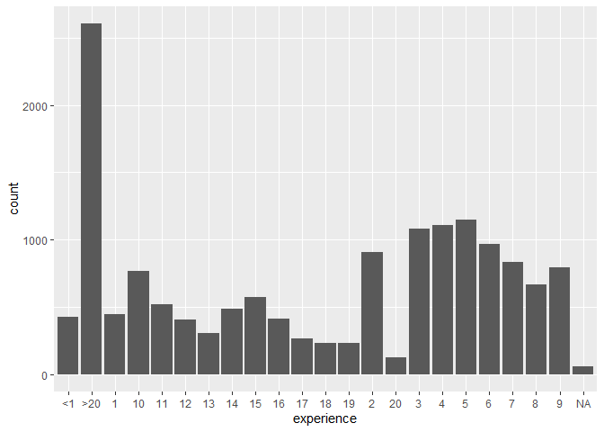

Predicting Data Scientists Looking for a Job Change
================
Kate Morris
11/7/2021

## About this project

This project comes from a Kaggle data set designed for a fictitious HR
problem. There is a company involved in Data Science that is looking to
leverage the training it publicly offers to hire more Data Scientists.
Since many individuals sign up for this training, the company needs a
process to efficiently understand who may be seeking a new job and is
therefore eligible for hire, as it is not feasible to reach out to every
individual enrolled in the training to ask if they are seeking a new
job. Being able to optimize this process can minimize costs and
resources for the company as well as improve the training and
categorization of customers.

Given this problem, I will generate three different algorithms: logistic
regression, random forest, and XGBoost, to predict which customers in
the training are looking for a job change. I chose to use three
different algorithms to be able to utilize the different benefits each
algorithm offers as well as compare their performance for this
particular problem. Logistic regression has the benefit of
interpretability, but has assumptions that must be met. Random Forest
and XGBoost don’t require assumptions and can be highly accurate, but
lack interpretability. Because of this, I will generate each algorithm
and compare how they perform on the training data. I will then asses the
best performing algorithm on test data to evaluate how it performs on
new customers. When evaluating performance, I will generate a ROC curve
and calculate the AUC for each model.

The training dataset I will use to build my model is made up of 15,326
observations and contains 12 predictor variables related to the
demographics, experience, and education of the customers as predictors
(the majority of which are categorical. The target variable is made up
of two levels: Looking for a job change (1) and Not looking for a job
change (0).

This markdown contains the following steps: <br> -Load Packages and Data
<br> -Data Investigation <br> -Data Posturing <br> -EDA <br>
-Assumptions and Data Considerations <br> -Variable Selection <br>
-Logistic Regression Modeling <br> -Random Forest Modeling <br> -XGBoost
Modeling <br> -Assessing Final Model Accuracy <br> -Takeaways and
Conclusion <br>

## Load Packages and Data

``` r
library(tidyverse)
library(psych)
library(RColorBrewer)
library(mgcv)
library(InformationValue)
library(gmodels)
library(pROC)
library(randomForest)
library(xgboost)
library(caret)
library(smbinning)
```

``` r
data <- read.csv("aug_train.csv",na.strings=c("","NA"))
```

``` r
set.seed(12345)
aug <- data %>% sample_frac(0.8)
test <- anti_join(data, aug, by = 'enrollee_id')
```

## Data Investigation

For data investigation, I will look at which variables contain NA’s,
identify which variables are numeric, and which variables are
categorical. This will give me a baseline understanding of the data I am
working with, and prompt what kind of data posturing will be needed.

Initial identification of variable type for each variable: <br>

enrollee_id - unique identifier <br> city - CATEGORICAL <br>
city_development_index - CONTINUOUS <br> gender - CATEGORICAL <br>
relevant experience - CATEGORICAL <br> enrolled_university - CATEGORICAL
<br> education_level - CATEGORICAL <br> major_discipline - CATEGORICAL
<br> experience - CATEGORICAL <br> company_size - CATEGORICAL <br>
company_type - CATEGORICAL <br> last_new_job - CATEGORICAL <br>
training_hours - CONTINUOUS <br> target - target variable - will be
binary <br> <br>

Find NA’s:

``` r
colSums(is.na(aug))
```

    ##            enrollee_id                   city city_development_index 
    ##                      0                      0                      0 
    ##                 gender    relevent_experience    enrolled_university 
    ##                   3606                      0                    311 
    ##        education_level       major_discipline             experience 
    ##                    363                   2261                     55 
    ##           company_size           company_type           last_new_job 
    ##                   4780                   4917                    334 
    ##         training_hours                 target 
    ##                      0                      0

Variables with NAs: <br>

gender <br> enrolled_university <br> education_level <br>
major_discipline <br> experience <br> company_size <br> company_type
<br> last_new_job <br>

Determine which variables are numeric:

``` r
numeric_vars <- aug %>% 
  select_if(~is.numeric(.x))
head(numeric_vars)
```

    ##   enrollee_id city_development_index training_hours target
    ## 1       31335                  0.698             94      1
    ## 2       24646                  0.780            165      0
    ## 3        9642                  0.624             45      0
    ## 4       10454                  0.920             40      0
    ## 5        8163                  0.926             73      0
    ## 6        5952                  0.624             54      1

enrollee_id - unique identifier <br> city_development_index - numeric
<br> training_hours - numeric but let’s check to see if bins would be
better <br> target - will be converted to binary <br>

Investigate training_hours variable:

``` r
length(unique(aug$training_hours))
```

    ## [1] 241

241 unique values, so training hours will remain numeric.

Check which variables are categorical

``` r
qual_vars <- aug %>% 
  select_if(~!is.numeric(.x))
head(qual_vars)
```

    ##       city gender     relevent_experience enrolled_university education_level
    ## 1 city_152 Female  No relevent experience    Full time course        Graduate
    ## 2 city_120   Male Has relevent experience       no_enrollment        Graduate
    ## 3  city_21 Female Has relevent experience       no_enrollment        Graduate
    ## 4 city_103 Female  No relevent experience       no_enrollment        Graduate
    ## 5 city_114   Male Has relevent experience    Full time course        Graduate
    ## 6  city_21   Male Has relevent experience       no_enrollment         Masters
    ##   major_discipline experience company_size  company_type last_new_job
    ## 1             STEM          8    1000-4999 Public Sector            1
    ## 2             STEM          6      100-500       Pvt Ltd            2
    ## 3             STEM          6       10000+       Pvt Ltd            1
    ## 4       Humanities          3      100-500       Pvt Ltd            3
    ## 5             STEM          9         <NA>          <NA>            2
    ## 6             STEM         20       10000+       Pvt Ltd           >4

Now that we have identified each categorical variable, lets investigate
each categorical variable to see how many levels are in each category
and how many observations are in each level:

``` r
for (i in 1:length(qual_vars)){
  tab <- table(qual_vars[,i])
  print(tab)}
```

    ## 
    ##   city_1  city_10 city_100 city_101 city_102 city_103 city_104 city_105 
    ##       20       65      222       59      250     3512      236       64 
    ## city_106 city_107 city_109  city_11 city_111 city_114 city_115 city_116 
    ##        6        4        6      194        2     1057       48      104 
    ## city_117 city_118  city_12 city_120 city_121 city_123 city_126 city_127 
    ##        8       23       12        5        3       64       24       10 
    ## city_128 city_129  city_13 city_131 city_133 city_134 city_136 city_138 
    ##       71        3       35        8        9       34      472       94 
    ## city_139  city_14 city_140 city_141 city_142 city_143 city_144 city_145 
    ##        3       23        1       23       47       28       24       51 
    ## city_146 city_149 city_150 city_152 city_155 city_157 city_158 city_159 
    ##        6       86       55       39       12       18       35       77 
    ##  city_16 city_160 city_162 city_165 city_166 city_167 city_173 city_175 
    ##     1241      652       96       64        4        8      114        9 
    ## city_176 city_179  city_18 city_180  city_19   city_2  city_20  city_21 
    ##       22        2        3        6      104        5       22     2142 
    ##  city_23  city_24  city_25  city_26  city_27  city_28  city_30  city_31 
    ##      149       53        3       17       39      147       16        4 
    ##  city_33  city_36  city_37  city_39  city_40  city_41  city_42  city_43 
    ##       13      122       11        9       53       72        8       10 
    ##  city_44  city_45  city_46  city_48  city_50  city_53  city_54  city_55 
    ##       15       97       98       12      113       19       11       11 
    ##  city_57  city_59  city_61  city_62  city_64  city_65  city_67  city_69 
    ##       83       10      156        5       97      142      350       14 
    ##   city_7  city_70  city_71  city_72  city_73  city_74  city_75  city_76 
    ##       20       33      220       19      216       85      239       39 
    ##  city_77  city_78  city_79   city_8  city_80  city_81  city_82  city_83 
    ##       22       28        7        3       13        6        4      122 
    ##  city_84  city_89   city_9  city_90  city_91  city_93  city_94  city_97 
    ##       22       56       16      158       34       19       19       84 
    ##  city_98  city_99 
    ##       62       75 
    ## 
    ## Female   Male  Other 
    ##    991  10579    150 
    ## 
    ## Has relevent experience  No relevent experience 
    ##                   11035                    4291 
    ## 
    ## Full time course    no_enrollment Part time course 
    ##             2993            11073              949 
    ## 
    ##       Graduate    High School        Masters            Phd Primary School 
    ##           9273           1620           3483            331            256 
    ## 
    ##            Arts Business Degree      Humanities        No Major           Other 
    ##             207             251             546             187             298 
    ##            STEM 
    ##           11576 
    ## 
    ##   <1  >20    1   10   11   12   13   14   15   16   17   18   19    2   20    3 
    ##  422 2604  445  767  516  402  307  482  571  414  267  228  228  909  123 1079 
    ##    4    5    6    7    8    9 
    ## 1108 1145  964  832  664  794 
    ## 
    ##       <10     10/49   100-500 1000-4999    10000+     50-99   500-999 5000-9999 
    ##      1019      1148      2087      1062      1618      2457       703       452 
    ## 
    ## Early Stage Startup      Funded Startup                 NGO               Other 
    ##                 486                 788                 405                 103 
    ##       Public Sector             Pvt Ltd 
    ##                 755                7872 
    ## 
    ##    >4     1     2     3     4 never 
    ##  2593  6442  2292   824   839  2002

The two variables that jump out to me are “city” and “experience”
because they each have more than 10 levels. I will not use city in this
analysis because there are so many of levels of city and
city_development_index already provides more valuable information than
city does. For experience, I am unsure if I should make the variable
continuous or keep it categorical and create bins, so it requires some
more investigation. <br> <br>

Look at a distribution of experience variable:

``` r
aug %>% 
  ggplot(aes(x = experience))+
  geom_histogram(stat = "count")
```

<!-- -->

Based on this plot, there are over 2500 people with \>20 years of
experience, but much fewer people with high amounts of years of
experience (for example, 19 years has about 250 people). Due to the
large differences in counts for each amount of experience, I think it
makes more sense to bin the variables. To help figure out how to best
bin the variables, I will look at the proportion of 1s of the target for
each group of years of experiences to see if there are logically ways to
group experience based on the relationship to the target. <br>

``` r
aug %>% 
  group_by(as.factor(experience)) %>% 
  summarise(prop_1s = mean(target)) %>% 
  arrange(prop_1s)
```

    ## # A tibble: 23 x 2
    ##    `as.factor(experience)` prop_1s
    ##    <fct>                     <dbl>
    ##  1 16                        0.135
    ##  2 >20                       0.155
    ##  3 15                        0.161
    ##  4 18                        0.162
    ##  5 19                        0.162
    ##  6 17                        0.172
    ##  7 12                        0.177
    ##  8 14                        0.185
    ##  9 13                        0.199
    ## 10 10                        0.201
    ## # ... with 13 more rows

From this, I can see that generally, higher years of experience is
associated with lower proportions of people looking for a new job (which
could make sense because people further along in their careers are
probably more set in their jobs). However, I do not see a super obvious
way to group beyond that, so I will use optimal binning to determine my
bins.

<br>

``` r
#prep data
aug <- aug %>% 
    mutate(experience = ifelse(experience == "<1",0,experience)) %>% #convert <1 to 0 so R can handle the value
    mutate(experience = ifelse(experience == ">20",21,experience)) %>%
    mutate(experience = as.numeric(experience))

#find optimal splits
result <- smbinning(aug, y = "target", x = "experience")
result$ivtable
```

    ##   Cutpoint CntRec CntGood CntBad CntCumRec CntCumGood CntCumBad PctRec GoodRate
    ## 1     <= 1    867     374    493       867        374       493 0.0566   0.4314
    ## 2     <= 4   3096    1054   2042      3963       1428      2535 0.2020   0.3404
    ## 3     <= 7   2941     842   2099      6904       2270      4634 0.1919   0.2863
    ## 4    <= 11   2741     596   2145      9645       2866      6779 0.1788   0.2174
    ## 5     > 11   5626     919   4707     15271       3785     11486 0.3671   0.1633
    ## 6  Missing     55      18     37     15326       3803     11523 0.0036   0.3273
    ## 7    Total  15326    3803  11523        NA         NA        NA 1.0000   0.2481
    ##   BadRate   Odds  LnOdds     WoE     IV
    ## 1  0.5686 0.7586 -0.2763  0.8323 0.0462
    ## 2  0.6596 0.5162 -0.6613  0.4472 0.0447
    ## 3  0.7137 0.4011 -0.9134  0.1951 0.0077
    ## 4  0.7826 0.2779 -1.2807 -0.1721 0.0051
    ## 5  0.8367 0.1952 -1.6335 -0.5250 0.0876
    ## 6  0.6727 0.4865 -0.7205  0.3880 0.0006
    ## 7  0.7519 0.3300 -1.1086  0.0000 0.1919

The optimal binning algorithm produced the following bins: <br> 0-1,
2-4, 5-7, 8-11, 12+ <br>

Now I will convert experience to these recommended bins

``` r
aug <- aug %>% 
    mutate(experience = cut(as.numeric(experience), breaks = c(-Inf,1,4,7,11,Inf),right = T,labels = c("0-1","2-4","5-7","8-11","12+"))) %>% 
    mutate(experience = as.character(experience))
```

Now that the numeric and categorical variables have been identified and
adjusted for more optimal use, I will revisit the variables with NA’s.

Check NAs

``` r
colSums(is.na(aug))
```

    ##            enrollee_id                   city city_development_index 
    ##                      0                      0                      0 
    ##                 gender    relevent_experience    enrolled_university 
    ##                   3606                      0                    311 
    ##        education_level       major_discipline             experience 
    ##                    363                   2261                     55 
    ##           company_size           company_type           last_new_job 
    ##                   4780                   4917                    334 
    ##         training_hours                 target 
    ##                      0                      0

Since all variables with NA’s are categorical, I will replace NA’s with
“Missing” to create a “Missing” level for the variables needed.

Replace ‘NAs’ with “Missing”

``` r
aug <- aug %>% 
  replace(is.na(.),"Missing")
```

Check NAs again

``` r
colSums(is.na(aug))
```

    ##            enrollee_id                   city city_development_index 
    ##                      0                      0                      0 
    ##                 gender    relevent_experience    enrolled_university 
    ##                      0                      0                      0 
    ##        education_level       major_discipline             experience 
    ##                      0                      0                      0 
    ##           company_size           company_type           last_new_job 
    ##                      0                      0                      0 
    ##         training_hours                 target 
    ##                      0                      0

No more NAs!

## Data Posturing

We have an initial understanding of the types of each variable, so now I
will do some further data posturing to prepare data for analysis.

Variable: **education_level**  
The “Graduate” level of education_level is confusing because it refers
graduating from university (as opposed to being a “graduate student”).
Because of this, we will recode “Graduate” to be “Undergraduate” to
better distinguish it from the “Masters” education level).

``` r
aug <- aug %>% 
  mutate(education_level = ifelse(education_level == "Graduate","Undergraduate",education_level)) %>% 
  mutate(education_level = as.factor(education_level))
```

Variable: **target** Our target variable, currently called “target” is
dummy coded (1 = Looking for a job; 0 = Not looking for a job). I will
create a new target variable that contains the strings “Looking” and
“Not looking” to have a target variable that is very easy to use and
understand which level is which.

``` r
aug <- aug %>% 
  mutate(target_factor = ifelse(target == 1,"Looking","Not Looking")) %>% 
  mutate(target_factor = as.factor(target_factor))
```

Lastly, I will convert all of the categorical variables in the data set
to be factors so they are ready to use for analysis.

``` r
aug <- aug %>%
  mutate_if(is.character,as.factor)

aug <- aug %>%
  mutate(enrollee_id = as.factor(enrollee_id))
```

That completes data posturing. Now I can start exploring the data!

## EDA

### Univariate EDA

For Univariate EDA, I will visualize each variable to get a sense of how
the values (or levels) are distributed in the data. For my numeric
values, I will also calculate summary statistics to obtain the central
tendency and spread of the distribution for each variable.

Visualize each categorical variable

``` r
factor_vars <- aug %>%
  select(-enrollee_id,city) %>% 
  select_if(~!is.numeric(.x))

for (i in 1:length(factor_vars)){
  plot(factor_vars[,i])}
```

<!-- --><!-- --><!-- --><!-- --><!-- --><!-- --><!-- --><!-- --><!-- --><!-- --><!-- -->

Further target variable exploration:  
View proportion of looking and not looking

``` r
prop.table(table(aug$target_factor))
```

    ## 
    ##     Looking Not Looking 
    ##   0.2481404   0.7518596

Some takeaways: <br> -More males than females <br> -More relevant
experience than no relevant experience <br> -Most people not currently
enrolled in university courses <br> -Most people have education level of
undergraduate degree <br> -Most people are STEM majors <br> -About 3/4
of individuals are not looking for a new job, whereas about 1/4 of
individuals are <br>

Visualize each numeric variable:

``` r
aug %>% 
  ggplot(aes(x = training_hours))+
  geom_boxplot()+
  labs(x = "Training Hours")
```

<!-- -->

``` r
aug %>% 
  ggplot(aes(x = training_hours))+
    geom_histogram()+
    labs(x = "Training Hours", y = "Count")
```

<!-- -->

Training hours has a right skewed distribution.

``` r
aug %>% 
  ggplot(aes(x = city_development_index))+
  geom_boxplot()+
    labs(x = "City Development Index")
```

<!-- -->

``` r
aug %>% 
  ggplot(aes(x = city_development_index))+
    geom_histogram()+
    labs(x = "City Development Index", y = "Count")
```

<!-- -->

City development index - no obvious distribution, but generally left
skewed.

Numeric Summary stats:

Variable: **city_development_index**

``` r
describe(aug$city_development_index)
```

    ##    vars     n mean   sd median trimmed  mad  min  max range skew kurtosis se
    ## X1    1 15326 0.83 0.12    0.9    0.85 0.03 0.45 0.95   0.5   -1    -0.53  0

Variable: **training_hours**

``` r
describe(aug$training_hours)
```

    ##    vars     n mean    sd median trimmed mad min max range skew kurtosis   se
    ## X1    1 15326 65.3 60.11     47   54.95  43   1 336   335 1.83      3.9 0.49

## Bivariate EDA

For bivariate EDA of the variables, I will create visualizations of each
predictor variable stratified by the target variable to get a better
understanding of the relationship between the predictor variables and
the target. To supplement the visualizations, I will create cross
tables/summary statistics to clarify what I am seeing in the
visualizations.

### Categorical Variables

``` r
aug %>% 
  ggplot(aes(x = target_factor, fill = gender))+
    geom_bar(position = "dodge")+
    scale_fill_brewer(palette="Dark2")+
    labs(x = "Looking for a job?", y = "Count")
```

<!-- -->

``` r
CrossTable(aug$gender,aug$target_factor)
```

    ## 
    ##  
    ##    Cell Contents
    ## |-------------------------|
    ## |                       N |
    ## | Chi-square contribution |
    ## |           N / Row Total |
    ## |           N / Col Total |
    ## |         N / Table Total |
    ## |-------------------------|
    ## 
    ##  
    ## Total Observations in Table:  15326 
    ## 
    ##  
    ##              | aug$target_factor 
    ##   aug$gender |     Looking | Not Looking |   Row Total | 
    ## -------------|-------------|-------------|-------------|
    ##       Female |         254 |         737 |         991 | 
    ##              |       0.266 |       0.088 |             | 
    ##              |       0.256 |       0.744 |       0.065 | 
    ##              |       0.067 |       0.064 |             | 
    ##              |       0.017 |       0.048 |             | 
    ## -------------|-------------|-------------|-------------|
    ##         Male |        2388 |        8191 |       10579 | 
    ##              |      21.411 |       7.066 |             | 
    ##              |       0.226 |       0.774 |       0.690 | 
    ##              |       0.628 |       0.711 |             | 
    ##              |       0.156 |       0.534 |             | 
    ## -------------|-------------|-------------|-------------|
    ##      Missing |        1120 |        2486 |        3606 | 
    ##              |      56.681 |      18.707 |             | 
    ##              |       0.311 |       0.689 |       0.235 | 
    ##              |       0.295 |       0.216 |             | 
    ##              |       0.073 |       0.162 |             | 
    ## -------------|-------------|-------------|-------------|
    ##        Other |          41 |         109 |         150 | 
    ##              |       0.384 |       0.127 |             | 
    ##              |       0.273 |       0.727 |       0.010 | 
    ##              |       0.011 |       0.009 |             | 
    ##              |       0.003 |       0.007 |             | 
    ## -------------|-------------|-------------|-------------|
    ## Column Total |        3803 |       11523 |       15326 | 
    ##              |       0.248 |       0.752 |             | 
    ## -------------|-------------|-------------|-------------|
    ## 
    ## 

In terms of proportion, there are a lot more males not looking for a job
(71% of all people not looking) than males looking for jobs (63% of all
people looking). <br>

``` r
aug %>% 
  ggplot(aes(x = target_factor, fill = relevent_experience))+
    geom_bar(position = "dodge")+
    scale_fill_brewer(palette="Dark2")+
    labs(x = "Looking for a job?", y = "Count")
```

<!-- -->

``` r
CrossTable(aug$relevent_experience,aug$target_factor)
```

    ## 
    ##  
    ##    Cell Contents
    ## |-------------------------|
    ## |                       N |
    ## | Chi-square contribution |
    ## |           N / Row Total |
    ## |           N / Col Total |
    ## |         N / Table Total |
    ## |-------------------------|
    ## 
    ##  
    ## Total Observations in Table:  15326 
    ## 
    ##  
    ##                         | aug$target_factor 
    ## aug$relevent_experience |     Looking | Not Looking |   Row Total | 
    ## ------------------------|-------------|-------------|-------------|
    ## Has relevent experience |        2331 |        8704 |       11035 | 
    ##                         |      60.563 |      19.988 |             | 
    ##                         |       0.211 |       0.789 |       0.720 | 
    ##                         |       0.613 |       0.755 |             | 
    ##                         |       0.152 |       0.568 |             | 
    ## ------------------------|-------------|-------------|-------------|
    ##  No relevent experience |        1472 |        2819 |        4291 | 
    ##                         |     155.748 |      51.402 |             | 
    ##                         |       0.343 |       0.657 |       0.280 | 
    ##                         |       0.387 |       0.245 |             | 
    ##                         |       0.096 |       0.184 |             | 
    ## ------------------------|-------------|-------------|-------------|
    ##            Column Total |        3803 |       11523 |       15326 | 
    ##                         |       0.248 |       0.752 |             | 
    ## ------------------------|-------------|-------------|-------------|
    ## 
    ## 

25% of people who are not looking for a job change do not have relevant
experience, whereas 39% of people in the group looking for a job do not
have relevant experience. This aligns with what I would expect, as I
would imagine that people looking for a job change are probably more
likely to be people that are trying to move into the Data Science field
and may not necessarily have prior experience.  
<br>

``` r
aug %>% 
  mutate(experience = factor(experience, levels = c("0-1","2-4","5-7","8-11","12+"))) %>% 
  ggplot(aes(x = target_factor, fill = experience))+
    geom_bar(position = "dodge")+
    scale_fill_brewer(palette="Dark2")+
    labs(x = "Looking for a job?", y = "Count")
```

<!-- -->

``` r
CrossTable(aug$experience,aug$target_factor)
```

    ## 
    ##  
    ##    Cell Contents
    ## |-------------------------|
    ## |                       N |
    ## | Chi-square contribution |
    ## |           N / Row Total |
    ## |           N / Col Total |
    ## |         N / Table Total |
    ## |-------------------------|
    ## 
    ##  
    ## Total Observations in Table:  15326 
    ## 
    ##  
    ##                | aug$target_factor 
    ## aug$experience |     Looking | Not Looking |   Row Total | 
    ## ---------------|-------------|-------------|-------------|
    ##            0-1 |         374 |         493 |         867 | 
    ##                |     117.307 |      38.716 |             | 
    ##                |       0.431 |       0.569 |       0.057 | 
    ##                |       0.098 |       0.043 |             | 
    ##                |       0.024 |       0.032 |             | 
    ## ---------------|-------------|-------------|-------------|
    ##            12+ |         919 |        4707 |        5626 | 
    ##                |     163.008 |      53.798 |             | 
    ##                |       0.163 |       0.837 |       0.367 | 
    ##                |       0.242 |       0.408 |             | 
    ##                |       0.060 |       0.307 |             | 
    ## ---------------|-------------|-------------|-------------|
    ##            2-4 |        1054 |        2042 |        3096 | 
    ##                |     106.291 |      35.080 |             | 
    ##                |       0.340 |       0.660 |       0.202 | 
    ##                |       0.277 |       0.177 |             | 
    ##                |       0.069 |       0.133 |             | 
    ## ---------------|-------------|-------------|-------------|
    ##            5-7 |         842 |        2099 |        2941 | 
    ##                |      17.256 |       5.695 |             | 
    ##                |       0.286 |       0.714 |       0.192 | 
    ##                |       0.221 |       0.182 |             | 
    ##                |       0.055 |       0.137 |             | 
    ## ---------------|-------------|-------------|-------------|
    ##           8-11 |         596 |        2145 |        2741 | 
    ##                |      10.412 |       3.436 |             | 
    ##                |       0.217 |       0.783 |       0.179 | 
    ##                |       0.157 |       0.186 |             | 
    ##                |       0.039 |       0.140 |             | 
    ## ---------------|-------------|-------------|-------------|
    ##        Missing |          18 |          37 |          55 | 
    ##                |       1.388 |       0.458 |             | 
    ##                |       0.327 |       0.673 |       0.004 | 
    ##                |       0.005 |       0.003 |             | 
    ##                |       0.001 |       0.002 |             | 
    ## ---------------|-------------|-------------|-------------|
    ##   Column Total |        3803 |       11523 |       15326 | 
    ##                |       0.248 |       0.752 |             | 
    ## ---------------|-------------|-------------|-------------|
    ## 
    ## 

People with 0-1 and 2-4 years of experience make up a greater proportion
of people looking for a job (38% of looking group) than the group of
people not looking for a job (22% of not looking group). On the flip
side, people with 12+ years of experience make up a smaller proportion
of people looking for a job (24% of looking group) than people not
looking for a job (41% of the not looking group). It may be that people
who are earlier on in their careers would be more likely to be looking
for a job change as opposed to people who are further along in their
careers. <br>

``` r
aug %>% 
  ggplot(aes(x = target_factor, fill = enrolled_university))+
    geom_bar(position = "dodge")+
    scale_fill_brewer(palette="Dark2")+
    labs(x = "Looking for a job?", y = "Count")
```

<!-- -->

``` r
CrossTable(aug$enrolled_university,aug$target_factor)
```

    ## 
    ##  
    ##    Cell Contents
    ## |-------------------------|
    ## |                       N |
    ## | Chi-square contribution |
    ## |           N / Row Total |
    ## |           N / Col Total |
    ## |         N / Table Total |
    ## |-------------------------|
    ## 
    ##  
    ## Total Observations in Table:  15326 
    ## 
    ##  
    ##                         | aug$target_factor 
    ## aug$enrolled_university |     Looking | Not Looking |   Row Total | 
    ## ------------------------|-------------|-------------|-------------|
    ##        Full time course |        1138 |        1855 |        2993 | 
    ##                         |     210.419 |      69.446 |             | 
    ##                         |       0.380 |       0.620 |       0.195 | 
    ##                         |       0.299 |       0.161 |             | 
    ##                         |       0.074 |       0.121 |             | 
    ## ------------------------|-------------|-------------|-------------|
    ##                 Missing |          99 |         212 |         311 | 
    ##                         |       6.174 |       2.038 |             | 
    ##                         |       0.318 |       0.682 |       0.020 | 
    ##                         |       0.026 |       0.018 |             | 
    ##                         |       0.006 |       0.014 |             | 
    ## ------------------------|-------------|-------------|-------------|
    ##           no_enrollment |        2330 |        8743 |       11073 | 
    ##                         |      63.486 |      20.953 |             | 
    ##                         |       0.210 |       0.790 |       0.722 | 
    ##                         |       0.613 |       0.759 |             | 
    ##                         |       0.152 |       0.570 |             | 
    ## ------------------------|-------------|-------------|-------------|
    ##        Part time course |         236 |         713 |         949 | 
    ##                         |       0.001 |       0.000 |             | 
    ##                         |       0.249 |       0.751 |       0.062 | 
    ##                         |       0.062 |       0.062 |             | 
    ##                         |       0.015 |       0.047 |             | 
    ## ------------------------|-------------|-------------|-------------|
    ##            Column Total |        3803 |       11523 |       15326 | 
    ##                         |       0.248 |       0.752 |             | 
    ## ------------------------|-------------|-------------|-------------|
    ## 
    ## 

The people who are enrolled in university full time make up a greater
proportion of the people looking for a job change (30%) than compared to
the people not looking for a job change (16%). Additionally, the people
who are not enrolled in university make up a greater proportion of
people that are not looking for a job change (76%) than people who are
looking for a job change (61%). Again this aligns with intuition in that
people are enrolled in university would be looking for a job more
frequently than people who have had more work experienced (and are
therefore more established in their careers). <br>

``` r
aug %>% 
  mutate(education_level = factor(education_level, levels = c("Missing","Primary School","High School","Undergraduate","Masters","Phd"))) %>% 
  ggplot(aes(x = target_factor, fill = education_level))+
    geom_bar(position = "dodge")+
    scale_fill_brewer(palette="Dark2")+
    labs(x = "Looking for a job?", y = "Count")
```

<!-- -->

``` r
CrossTable(aug$education_level,aug$target_factor)
```

    ## 
    ##  
    ##    Cell Contents
    ## |-------------------------|
    ## |                       N |
    ## | Chi-square contribution |
    ## |           N / Row Total |
    ## |           N / Col Total |
    ## |         N / Table Total |
    ## |-------------------------|
    ## 
    ##  
    ## Total Observations in Table:  15326 
    ## 
    ##  
    ##                     | aug$target_factor 
    ## aug$education_level |     Looking | Not Looking |   Row Total | 
    ## --------------------|-------------|-------------|-------------|
    ##         High School |         311 |        1309 |        1620 | 
    ##                     |      20.594 |       6.797 |             | 
    ##                     |       0.192 |       0.808 |       0.106 | 
    ##                     |       0.082 |       0.114 |             | 
    ##                     |       0.020 |       0.085 |             | 
    ## --------------------|-------------|-------------|-------------|
    ##             Masters |         748 |        2735 |        3483 | 
    ##                     |      15.643 |       5.163 |             | 
    ##                     |       0.215 |       0.785 |       0.227 | 
    ##                     |       0.197 |       0.237 |             | 
    ##                     |       0.049 |       0.178 |             | 
    ## --------------------|-------------|-------------|-------------|
    ##             Missing |          80 |         283 |         363 | 
    ##                     |       1.127 |       0.372 |             | 
    ##                     |       0.220 |       0.780 |       0.024 | 
    ##                     |       0.021 |       0.025 |             | 
    ##                     |       0.005 |       0.018 |             | 
    ## --------------------|-------------|-------------|-------------|
    ##                 Phd |          42 |         289 |         331 | 
    ##                     |      19.611 |       6.472 |             | 
    ##                     |       0.127 |       0.873 |       0.022 | 
    ##                     |       0.011 |       0.025 |             | 
    ##                     |       0.003 |       0.019 |             | 
    ## --------------------|-------------|-------------|-------------|
    ##      Primary School |          33 |         223 |         256 | 
    ##                     |      14.667 |       4.841 |             | 
    ##                     |       0.129 |       0.871 |       0.017 | 
    ##                     |       0.009 |       0.019 |             | 
    ##                     |       0.002 |       0.015 |             | 
    ## --------------------|-------------|-------------|-------------|
    ##       Undergraduate |        2589 |        6684 |        9273 | 
    ##                     |      36.045 |      11.896 |             | 
    ##                     |       0.279 |       0.721 |       0.605 | 
    ##                     |       0.681 |       0.580 |             | 
    ##                     |       0.169 |       0.436 |             | 
    ## --------------------|-------------|-------------|-------------|
    ##        Column Total |        3803 |       11523 |       15326 | 
    ##                     |       0.248 |       0.752 |             | 
    ## --------------------|-------------|-------------|-------------|
    ## 
    ## 

People who have obtained an undergraduate level of education make up a
greater proportion of people looking for a job change (68%) than the
proportion of people who have obtained an undergraduate level of
education of those not looking for a job change (58%). <br>

``` r
aug %>% 
  ggplot(aes(x = target_factor, fill = major_discipline))+
    geom_bar(position = "dodge")+
    scale_fill_brewer(palette="Dark2")+
    labs(x = "Looking for a job?", y = "Count")
```

<!-- -->

``` r
CrossTable(aug$major_discipline,aug$target_factor)
```

    ## 
    ##  
    ##    Cell Contents
    ## |-------------------------|
    ## |                       N |
    ## | Chi-square contribution |
    ## |           N / Row Total |
    ## |           N / Col Total |
    ## |         N / Table Total |
    ## |-------------------------|
    ## 
    ##  
    ## Total Observations in Table:  15326 
    ## 
    ##  
    ##                      | aug$target_factor 
    ## aug$major_discipline |     Looking | Not Looking |   Row Total | 
    ## ---------------------|-------------|-------------|-------------|
    ##                 Arts |          46 |         161 |         207 | 
    ##                      |       0.560 |       0.185 |             | 
    ##                      |       0.222 |       0.778 |       0.014 | 
    ##                      |       0.012 |       0.014 |             | 
    ##                      |       0.003 |       0.011 |             | 
    ## ---------------------|-------------|-------------|-------------|
    ##      Business Degree |          73 |         178 |         251 | 
    ##                      |       1.844 |       0.609 |             | 
    ##                      |       0.291 |       0.709 |       0.016 | 
    ##                      |       0.019 |       0.015 |             | 
    ##                      |       0.005 |       0.012 |             | 
    ## ---------------------|-------------|-------------|-------------|
    ##           Humanities |         114 |         432 |         546 | 
    ##                      |       3.407 |       1.124 |             | 
    ##                      |       0.209 |       0.791 |       0.036 | 
    ##                      |       0.030 |       0.037 |             | 
    ##                      |       0.007 |       0.028 |             | 
    ## ---------------------|-------------|-------------|-------------|
    ##              Missing |         432 |        1829 |        2261 | 
    ##                      |      29.682 |       9.796 |             | 
    ##                      |       0.191 |       0.809 |       0.148 | 
    ##                      |       0.114 |       0.159 |             | 
    ##                      |       0.028 |       0.119 |             | 
    ## ---------------------|-------------|-------------|-------------|
    ##             No Major |          47 |         140 |         187 | 
    ##                      |       0.008 |       0.003 |             | 
    ##                      |       0.251 |       0.749 |       0.012 | 
    ##                      |       0.012 |       0.012 |             | 
    ##                      |       0.003 |       0.009 |             | 
    ## ---------------------|-------------|-------------|-------------|
    ##                Other |          82 |         216 |         298 | 
    ##                      |       0.877 |       0.290 |             | 
    ##                      |       0.275 |       0.725 |       0.019 | 
    ##                      |       0.022 |       0.019 |             | 
    ##                      |       0.005 |       0.014 |             | 
    ## ---------------------|-------------|-------------|-------------|
    ##                 STEM |        3009 |        8567 |       11576 | 
    ##                      |       6.489 |       2.142 |             | 
    ##                      |       0.260 |       0.740 |       0.755 | 
    ##                      |       0.791 |       0.743 |             | 
    ##                      |       0.196 |       0.559 |             | 
    ## ---------------------|-------------|-------------|-------------|
    ##         Column Total |        3803 |       11523 |       15326 | 
    ##                      |       0.248 |       0.752 |             | 
    ## ---------------------|-------------|-------------|-------------|
    ## 
    ## 

Interestingly, the proportions of the different major disciplines are
fairly similar between the looking for a job change and not looking for
a job change groups. The largest difference I am seeing is the
proportion of STEM majors in each group such that STEM majors make up
79% of people looking for a job change, while STEM majors make up 74% of
people not looking for a job change. <br>

``` r
aug %>% 
  mutate(company_size = factor(company_size, levels = c("Missing","<10","10/49","50-99","100-500","500-999","1000-4999","5000-9999","10000+"))) %>% 
  ggplot(aes(x = target_factor, fill = company_size))+
    geom_bar(position = "dodge")+
    scale_fill_brewer(palette="Set3")+
    labs(x = "Looking for a job?", y = "Count")
```

<!-- -->

``` r
CrossTable(aug$company_size,aug$target_factor)
```

    ## 
    ##  
    ##    Cell Contents
    ## |-------------------------|
    ## |                       N |
    ## | Chi-square contribution |
    ## |           N / Row Total |
    ## |           N / Col Total |
    ## |         N / Table Total |
    ## |-------------------------|
    ## 
    ##  
    ## Total Observations in Table:  15326 
    ## 
    ##  
    ##                  | aug$target_factor 
    ## aug$company_size |     Looking | Not Looking |   Row Total | 
    ## -----------------|-------------|-------------|-------------|
    ##              <10 |         164 |         855 |        1019 | 
    ##                  |      31.224 |      10.305 |             | 
    ##                  |       0.161 |       0.839 |       0.066 | 
    ##                  |       0.043 |       0.074 |             | 
    ##                  |       0.011 |       0.056 |             | 
    ## -----------------|-------------|-------------|-------------|
    ##            10/49 |         269 |         879 |        1148 | 
    ##                  |       0.884 |       0.292 |             | 
    ##                  |       0.234 |       0.766 |       0.075 | 
    ##                  |       0.071 |       0.076 |             | 
    ##                  |       0.018 |       0.057 |             | 
    ## -----------------|-------------|-------------|-------------|
    ##          100-500 |         329 |        1758 |        2087 | 
    ##                  |      68.881 |      22.733 |             | 
    ##                  |       0.158 |       0.842 |       0.136 | 
    ##                  |       0.087 |       0.153 |             | 
    ##                  |       0.021 |       0.115 |             | 
    ## -----------------|-------------|-------------|-------------|
    ##        1000-4999 |         155 |         907 |        1062 | 
    ##                  |      44.693 |      14.750 |             | 
    ##                  |       0.146 |       0.854 |       0.069 | 
    ##                  |       0.041 |       0.079 |             | 
    ##                  |       0.010 |       0.059 |             | 
    ## -----------------|-------------|-------------|-------------|
    ##           10000+ |         312 |        1306 |        1618 | 
    ##                  |      19.947 |       6.583 |             | 
    ##                  |       0.193 |       0.807 |       0.106 | 
    ##                  |       0.082 |       0.113 |             | 
    ##                  |       0.020 |       0.085 |             | 
    ## -----------------|-------------|-------------|-------------|
    ##            50-99 |         434 |        2023 |        2457 | 
    ##                  |      50.623 |      16.707 |             | 
    ##                  |       0.177 |       0.823 |       0.160 | 
    ##                  |       0.114 |       0.176 |             | 
    ##                  |       0.028 |       0.132 |             | 
    ## -----------------|-------------|-------------|-------------|
    ##          500-999 |         118 |         585 |         703 | 
    ##                  |      18.263 |       6.027 |             | 
    ##                  |       0.168 |       0.832 |       0.046 | 
    ##                  |       0.031 |       0.051 |             | 
    ##                  |       0.008 |       0.038 |             | 
    ## -----------------|-------------|-------------|-------------|
    ##        5000-9999 |          88 |         364 |         452 | 
    ##                  |       5.204 |       1.718 |             | 
    ##                  |       0.195 |       0.805 |       0.029 | 
    ##                  |       0.023 |       0.032 |             | 
    ##                  |       0.006 |       0.024 |             | 
    ## -----------------|-------------|-------------|-------------|
    ##          Missing |        1934 |        2846 |        4780 | 
    ##                  |     471.573 |     155.636 |             | 
    ##                  |       0.405 |       0.595 |       0.312 | 
    ##                  |       0.509 |       0.247 |             | 
    ##                  |       0.126 |       0.186 |             | 
    ## -----------------|-------------|-------------|-------------|
    ##     Column Total |        3803 |       11523 |       15326 | 
    ##                  |       0.248 |       0.752 |             | 
    ## -----------------|-------------|-------------|-------------|
    ## 
    ## 

It appears that the not looking for a job change group has a greater
proportion of each company size level relative to the portion of each
company size level in the looking for a job change group. This is
occurring because about 51% of the observations in the looking for a job
group are missing, while only about 25% of the observations in the not
looking for a job group are missing. It could be that this is picking up
on the individuals that do not have previous work experience. <br>

``` r
aug %>% 
  ggplot(aes(x = target_factor, fill = company_type))+
    geom_bar(position = "dodge")+
    scale_fill_brewer(palette="Dark2")+
    labs(x = "Looking for a job?", y = "Count")
```

<!-- -->

``` r
CrossTable(aug$company_type,aug$target_factor)
```

    ## 
    ##  
    ##    Cell Contents
    ## |-------------------------|
    ## |                       N |
    ## | Chi-square contribution |
    ## |           N / Row Total |
    ## |           N / Col Total |
    ## |         N / Table Total |
    ## |-------------------------|
    ## 
    ##  
    ## Total Observations in Table:  15326 
    ## 
    ##  
    ##                     | aug$target_factor 
    ##    aug$company_type |     Looking | Not Looking |   Row Total | 
    ## --------------------|-------------|-------------|-------------|
    ## Early Stage Startup |         103 |         383 |         486 | 
    ##                     |       2.567 |       0.847 |             | 
    ##                     |       0.212 |       0.788 |       0.032 | 
    ##                     |       0.027 |       0.033 |             | 
    ##                     |       0.007 |       0.025 |             | 
    ## --------------------|-------------|-------------|-------------|
    ##      Funded Startup |         114 |         674 |         788 | 
    ##                     |      33.999 |      11.221 |             | 
    ##                     |       0.145 |       0.855 |       0.051 | 
    ##                     |       0.030 |       0.058 |             | 
    ##                     |       0.007 |       0.044 |             | 
    ## --------------------|-------------|-------------|-------------|
    ##             Missing |        1911 |        3006 |        4917 | 
    ##                     |     391.223 |     129.118 |             | 
    ##                     |       0.389 |       0.611 |       0.321 | 
    ##                     |       0.502 |       0.261 |             | 
    ##                     |       0.125 |       0.196 |             | 
    ## --------------------|-------------|-------------|-------------|
    ##                 NGO |          73 |         332 |         405 | 
    ##                     |       7.523 |       2.483 |             | 
    ##                     |       0.180 |       0.820 |       0.026 | 
    ##                     |       0.019 |       0.029 |             | 
    ##                     |       0.005 |       0.022 |             | 
    ## --------------------|-------------|-------------|-------------|
    ##               Other |          25 |          78 |         103 | 
    ##                     |       0.012 |       0.004 |             | 
    ##                     |       0.243 |       0.757 |       0.007 | 
    ##                     |       0.007 |       0.007 |             | 
    ##                     |       0.002 |       0.005 |             | 
    ## --------------------|-------------|-------------|-------------|
    ##       Public Sector |         165 |         590 |         755 | 
    ##                     |       2.665 |       0.880 |             | 
    ##                     |       0.219 |       0.781 |       0.049 | 
    ##                     |       0.043 |       0.051 |             | 
    ##                     |       0.011 |       0.038 |             | 
    ## --------------------|-------------|-------------|-------------|
    ##             Pvt Ltd |        1412 |        6460 |        7872 | 
    ##                     |     150.035 |      49.517 |             | 
    ##                     |       0.179 |       0.821 |       0.514 | 
    ##                     |       0.371 |       0.561 |             | 
    ##                     |       0.092 |       0.422 |             | 
    ## --------------------|-------------|-------------|-------------|
    ##        Column Total |        3803 |       11523 |       15326 | 
    ##                     |       0.248 |       0.752 |             | 
    ## --------------------|-------------|-------------|-------------|
    ## 
    ## 

Similar to the company size variable, the looking for a job change group
contains about 50% missing observations, potentially capturing
individuals that do not currently work. However, something that is
interesting is that people who work for Pvt Ltd companies make up 56% of
the individuals not looking for a job change, while people who work for
Pvt Ltd companies make up 37% of the individuals looking for a job
change. This is the largest disparity in terms of proportion. <br>

``` r
aug %>% 
  mutate(last_new_job = factor(last_new_job, levels = c("Missing","never","1","2","3","4",">4"))) %>% 
  ggplot(aes(x = target_factor, fill = last_new_job))+
    geom_bar(position = "dodge")+
    scale_fill_brewer(palette="Dark2")+
    labs(x = "Looking for a job?", y = "Count")
```

<!-- -->

``` r
CrossTable(aug$last_new_job,aug$target_factor)
```

    ## 
    ##  
    ##    Cell Contents
    ## |-------------------------|
    ## |                       N |
    ## | Chi-square contribution |
    ## |           N / Row Total |
    ## |           N / Col Total |
    ## |         N / Table Total |
    ## |-------------------------|
    ## 
    ##  
    ## Total Observations in Table:  15326 
    ## 
    ##  
    ##                  | aug$target_factor 
    ## aug$last_new_job |     Looking | Not Looking |   Row Total | 
    ## -----------------|-------------|-------------|-------------|
    ##               >4 |         465 |        2128 |        2593 | 
    ##                  |      49.480 |      16.330 |             | 
    ##                  |       0.179 |       0.821 |       0.169 | 
    ##                  |       0.122 |       0.185 |             | 
    ##                  |       0.030 |       0.139 |             | 
    ## -----------------|-------------|-------------|-------------|
    ##                1 |        1678 |        4764 |        6442 | 
    ##                  |       3.952 |       1.304 |             | 
    ##                  |       0.260 |       0.740 |       0.420 | 
    ##                  |       0.441 |       0.413 |             | 
    ##                  |       0.109 |       0.311 |             | 
    ## -----------------|-------------|-------------|-------------|
    ##                2 |         551 |        1741 |        2292 | 
    ##                  |       0.553 |       0.183 |             | 
    ##                  |       0.240 |       0.760 |       0.150 | 
    ##                  |       0.145 |       0.151 |             | 
    ##                  |       0.036 |       0.114 |             | 
    ## -----------------|-------------|-------------|-------------|
    ##                3 |         187 |         637 |         824 | 
    ##                  |       1.492 |       0.493 |             | 
    ##                  |       0.227 |       0.773 |       0.054 | 
    ##                  |       0.049 |       0.055 |             | 
    ##                  |       0.012 |       0.042 |             | 
    ## -----------------|-------------|-------------|-------------|
    ##                4 |         185 |         654 |         839 | 
    ##                  |       2.583 |       0.853 |             | 
    ##                  |       0.221 |       0.779 |       0.055 | 
    ##                  |       0.049 |       0.057 |             | 
    ##                  |       0.012 |       0.043 |             | 
    ## -----------------|-------------|-------------|-------------|
    ##          Missing |         125 |         209 |         334 | 
    ##                  |      21.407 |       7.065 |             | 
    ##                  |       0.374 |       0.626 |       0.022 | 
    ##                  |       0.033 |       0.018 |             | 
    ##                  |       0.008 |       0.014 |             | 
    ## -----------------|-------------|-------------|-------------|
    ##            never |         612 |        1390 |        2002 | 
    ##                  |      26.725 |       8.820 |             | 
    ##                  |       0.306 |       0.694 |       0.131 | 
    ##                  |       0.161 |       0.121 |             | 
    ##                  |       0.040 |       0.091 |             | 
    ## -----------------|-------------|-------------|-------------|
    ##     Column Total |        3803 |       11523 |       15326 | 
    ##                  |       0.248 |       0.752 |             | 
    ## -----------------|-------------|-------------|-------------|
    ## 
    ## 

What is interesting is that the people who reported never having a
difference in years between their previous job and current job is not
extremely different between the two groups in terms of proportion (16%
of looking group vs 12% of not looking group). This is interesting
because both the “company_size” variable and “company_type” variables
both have about 50% missing values for the looking for a job change
group. There may be a data collection issue in terms of being able to
obtain information about the company, or maybe people don’t know or
don’t want to report company information. Additionally, it could be that
the high percentage of “missing” is representative of a different
attribute all together.

### Continuous Variables

``` r
aug %>% 
  ggplot(aes(fill = target_factor, y = training_hours)) + 
    geom_boxplot()+
    labs(y = "Training Hours")
```

<!-- -->

The spread of training hours for both groups appears to be very similar
and both have a median of just under 50 hours. Additionally, both have
quite a few outliers of training between \~175 and \~380 hours. This
would suggest to me that people who are looking for a job change aren’t
necessarily spending more time to complete the training. Time spent
training appears to be pretty standard regardless of the motivation
behind doing the training. <br>

``` r
aug %>% 
  ggplot(aes(fill = target_factor, y = city_development_index)) + 
    geom_boxplot()+
    labs(y = "City Development Index")
```

<!-- -->

The spread of city_development_index is much wider for those looking for
a job change, having an interquartile range of about .63-.92. The spread
of city_development_index is much narrower for those not looking for a
job change, having an interquartile range of about .8-.92. Additionally,
the median city_development index for those looking for a job change is
\~.74, while the median city_development index for those not looking for
a job change is above .9. Could this be reflective of job seekers coming
from more cities? More diverse cities? Maybe people looking for a job
change are younger and living in more affordable areas? <br>

That completes bivariate EDA. Now I will move on to checking assumptions
and making data considerations.

## Assumptions and Data Considerations

Since I will be conducting logistic regression, there are some
assumptions and data considerations to check prior to running the
algorithm. For assumptions, I will need to check the assumption that the
continuous variables are linearly related to the log(odds) of looking
for a job change. For data considerations, I will need to ensure that
there are no separation concerns, meaning that there are no level or
levels of a categorical variable that perfectly predicts the target.

### Linearity Assumption

Check assumption that the continuous predictor variables are linearly
related to the logit function. We can check this assumption by fitting a
GAM using our continuous variable as a predictor. If the splines say
that a straight line is the best “curve” to predict the target, then the
linearity assumption is met! However, if splines fit a very curved line,
then the linearity assumption is not met and we will bin the continuous
variable to make it categorical instead. <br>

Variable: **training_hours**

``` r
trainging_hours.gam <- gam(target_factor ~ s(training_hours),
               data = aug, family = binomial(link = 'logit'),
               method = 'REML')
summary(trainging_hours.gam)
```

    ## 
    ## Family: binomial 
    ## Link function: logit 
    ## 
    ## Formula:
    ## target_factor ~ s(training_hours)
    ## 
    ## Parametric coefficients:
    ##             Estimate Std. Error z value            Pr(>|z|)    
    ## (Intercept)  1.10915    0.01871   59.28 <0.0000000000000002 ***
    ## ---
    ## Signif. codes:  0 '***' 0.001 '**' 0.01 '*' 0.05 '.' 0.1 ' ' 1
    ## 
    ## Approximate significance of smooth terms:
    ##                     edf Ref.df Chi.sq p-value  
    ## s(training_hours) 1.453  1.778  7.556  0.0358 *
    ## ---
    ## Signif. codes:  0 '***' 0.001 '**' 0.01 '*' 0.05 '.' 0.1 ' ' 1
    ## 
    ## R-sq.(adj) =  0.000365   Deviance explained = 0.0423%
    ## -REML = 8589.8  Scale est. = 1         n = 15326

``` r
plot(trainging_hours.gam)
```

<!-- -->

Visually this looks linear! When I look at the statistical output I
would conclude that this is not linear based on an alpha level of .05.
However I have a very large sample of \~15,000 observations, so I need
to adjust my alpha level to account for sample size.

Calculate new alpha level:

``` r
a = 1-pchisq(log(nrow(aug)),1)
a
```

    ## [1] 0.001906647

Based on my sample size, I should use an alpha level of about .002.
Therefore, I will **fail to reject** my null hypothesis of linearity. I
will proceed with using training_hours as a continuous variable.

Variable: **city_development_index**

``` r
city_development_index.gam <- gam(target_factor ~ s(city_development_index),
               data = aug, family = binomial(link = 'logit'),
               method = 'REML')
summary(city_development_index.gam)
```

    ## 
    ## Family: binomial 
    ## Link function: logit 
    ## 
    ## Formula:
    ## target_factor ~ s(city_development_index)
    ## 
    ## Parametric coefficients:
    ##             Estimate Std. Error z value            Pr(>|z|)    
    ## (Intercept)  1.22848    0.02075    59.2 <0.0000000000000002 ***
    ## ---
    ## Signif. codes:  0 '***' 0.001 '**' 0.01 '*' 0.05 '.' 0.1 ' ' 1
    ## 
    ## Approximate significance of smooth terms:
    ##                             edf Ref.df Chi.sq             p-value    
    ## s(city_development_index) 7.773  8.552   1826 <0.0000000000000002 ***
    ## ---
    ## Signif. codes:  0 '***' 0.001 '**' 0.01 '*' 0.05 '.' 0.1 ' ' 1
    ## 
    ## R-sq.(adj) =  0.138   Deviance explained = 11.1%
    ## -REML = 7657.1  Scale est. = 1         n = 15326

``` r
plot(city_development_index.gam)
```

<!-- -->

OOF, this does not look linear. I will rebin city development index
since it does not meet linearity assumption. Similar to the way I
handled the “experience” variable, I will use optimal binning to
determine my cut offs for city_development_index.

``` r
result_cdi <- smbinning(aug, y = "target", x = "city_development_index")
result_cdi$ivtable
```

    ##   Cutpoint CntRec CntGood CntBad CntCumRec CntCumGood CntCumBad PctRec GoodRate
    ## 1 <= 0.624   2718    1605   1113      2718       1605      1113 0.1773   0.5905
    ## 2 <= 0.789   1925     504   1421      4643       2109      2534 0.1256   0.2618
    ## 3  <= 0.89   2042     309   1733      6685       2418      4267 0.1332   0.1513
    ## 4 <= 0.915   2466     274   2192      9151       2692      6459 0.1609   0.1111
    ## 5 <= 0.923   4294     930   3364     13445       3622      9823 0.2802   0.2166
    ## 6  > 0.923   1819     173   1646     15264       3795     11469 0.1187   0.0951
    ## 7  Missing      0       0      0     15264       3795     11469 0.0000      NaN
    ## 8    Total  15326    3803  11523        NA         NA        NA 1.0000   0.2481
    ##   BadRate   Odds  LnOdds     WoE     IV
    ## 1  0.4095 1.4420  0.3661  1.4746 0.4799
    ## 2  0.7382 0.3547 -1.0365  0.0720 0.0007
    ## 3  0.8487 0.1783 -1.7243 -0.6157 0.0426
    ## 4  0.8889 0.1250 -2.0794 -0.9709 0.1147
    ## 5  0.7834 0.2765 -1.2857 -0.1771 0.0084
    ## 6  0.9049 0.1051 -2.2528 -1.1443 0.1114
    ## 7     NaN    NaN     NaN     NaN    NaN
    ## 8  0.7519 0.3300 -1.1086  0.0000 0.7577

The optimal binning algorithm produced the following cut offs: <br>
.624, .789, .89, .915, .923, and \>.923

Bin levels that have similar relationships together:

``` r
aug <- aug %>% 
    mutate(city_development_index.bins = cut(as.numeric(city_development_index), breaks = c(0,.624,.789,.890,.915,.923,Inf),right = T,labels = c("0<=.624",".624<=.789",".789<=.890",".890<=.915",".915<=.923",">.923")))

table(aug$city_development_index.bins)
```

    ## 
    ##    0<=.624 .624<=.789 .789<=.890 .890<=.915 .915<=.923      >.923 
    ##       2718       1925       2042       2466       4294       1881

### Separation Concerns (categorical variables)

For data considerations, I will need to ensure that there is no
situation where a level or levels of a categorical variable perfectly
predicts the target. If this did occur, my logistic regression would
break because it wouldn’t be able to calculate a beta for the variable
(due to finding no maximum likelihood). To check for separation issues,
I will look at tables showing the counts of individuals in each level of
the predictor variable stratified by the target. If any of these counts
contain a 0, I know I have at least quasi-complete separation.

``` r
table(aug$gender,aug$target_factor)
```

    ##          
    ##           Looking Not Looking
    ##   Female      254         737
    ##   Male       2388        8191
    ##   Missing    1120        2486
    ##   Other        41         109

``` r
table(aug$relevent_experience,aug$target_factor)
```

    ##                          
    ##                           Looking Not Looking
    ##   Has relevent experience    2331        8704
    ##   No relevent experience     1472        2819

``` r
table(aug$experience,aug$target_factor)
```

    ##          
    ##           Looking Not Looking
    ##   0-1         374         493
    ##   12+         919        4707
    ##   2-4        1054        2042
    ##   5-7         842        2099
    ##   8-11        596        2145
    ##   Missing      18          37

``` r
table(aug$enrolled_university,aug$target_factor)
```

    ##                   
    ##                    Looking Not Looking
    ##   Full time course    1138        1855
    ##   Missing               99         212
    ##   no_enrollment       2330        8743
    ##   Part time course     236         713

``` r
table(aug$education_level,aug$target_factor)
```

    ##                 
    ##                  Looking Not Looking
    ##   High School        311        1309
    ##   Masters            748        2735
    ##   Missing             80         283
    ##   Phd                 42         289
    ##   Primary School      33         223
    ##   Undergraduate     2589        6684

``` r
table(aug$major_discipline,aug$target_factor)
```

    ##                  
    ##                   Looking Not Looking
    ##   Arts                 46         161
    ##   Business Degree      73         178
    ##   Humanities          114         432
    ##   Missing             432        1829
    ##   No Major             47         140
    ##   Other                82         216
    ##   STEM               3009        8567

``` r
table(aug$company_size,aug$target_factor)
```

    ##            
    ##             Looking Not Looking
    ##   <10           164         855
    ##   10/49         269         879
    ##   100-500       329        1758
    ##   1000-4999     155         907
    ##   10000+        312        1306
    ##   50-99         434        2023
    ##   500-999       118         585
    ##   5000-9999      88         364
    ##   Missing      1934        2846

``` r
table(aug$company_type,aug$target_factor)
```

    ##                      
    ##                       Looking Not Looking
    ##   Early Stage Startup     103         383
    ##   Funded Startup          114         674
    ##   Missing                1911        3006
    ##   NGO                      73         332
    ##   Other                    25          78
    ##   Public Sector           165         590
    ##   Pvt Ltd                1412        6460

``` r
table(aug$last_new_job,aug$target_factor)
```

    ##          
    ##           Looking Not Looking
    ##   >4          465        2128
    ##   1          1678        4764
    ##   2           551        1741
    ##   3           187         637
    ##   4           185         654
    ##   Missing     125         209
    ##   never       612        1390

``` r
table(aug$city_development_index.bins,aug$target_factor)
```

    ##             
    ##              Looking Not Looking
    ##   0<=.624       1605        1113
    ##   .624<=.789     504        1421
    ##   .789<=.890     309        1733
    ##   .890<=.915     274        2192
    ##   .915<=.923     930        3364
    ##   >.923          181        1700

Looking at each of these tables, I don’t see any separation concerns
with categorical variables. What we can’t see from these tables is if
there are any separation concerns with interactions, so I will have to
keep my eye out for any errors or anomalies in case there is separation
when considering interactions.

## Variable Selection

Now that I have addressed all of my data considerations, I am ready to
begin putting together my model!

First, I want to figure out which variables I should be using in my
model. To do this, I will use variable selection which will iteratively
select the variable will improve the performance of the model the most
using some kind of selection criteria. I will use stepwise selection
which will allow the model to both add and remove variables as it
iterates through the selection process, and I will use BIC as my
selection criteria because the BIC calculation accounts for sample size.
After I select my variables with stepwise selection, I will select for
any interactions between the variables. For this process I will use
forward selection so that I will only add interactions that add value to
the model rather than working backwards from a fully saturated model
that may contain lots of interactions that don’t add value. <br>

Create dataset with all variables that will go in the model

``` r
aug_train <- aug %>% 
  dplyr::select(city_development_index.bins, gender, relevent_experience, enrolled_university, education_level,major_discipline, experience, company_size, company_type, last_new_job, training_hours, target)
```

Create Empty and Full Models

``` r
full.model <- glm(target ~ ., data = aug_train, family = binomial(link = "logit"))
empty.model <- glm(target ~ 1, data = aug_train, family = binomial(link = "logit"))
```

Stepwise Selection (using BIC)

``` r
step.model <- step(empty.model,
                  scope = list(lower = formula(empty.model),
                               upper = formula(full.model)),
                  direction = "both", k = log(nrow(aug_train)))
```

    ## Start:  AIC=17183.43
    ## target ~ 1
    ## 
    ##                               Df Deviance   AIC
    ## + city_development_index.bins  5    15027 15085
    ## + company_size                 8    16262 16349
    ## + company_type                 6    16420 16487
    ## + experience                   5    16628 16686
    ## + enrolled_university          3    16824 16862
    ## + relevent_experience          1    16898 16917
    ## + education_level              5    17023 17080
    ## + last_new_job                 6    17032 17099
    ## + gender                       3    17072 17111
    ## + major_discipline             6    17114 17182
    ## <none>                              17174 17183
    ## + training_hours               1    17168 17187
    ## 
    ## Step:  AIC=15084.99
    ## target ~ city_development_index.bins
    ## 
    ##                               Df Deviance   AIC
    ## + company_size                 8    14138 14273
    ## + company_type                 6    14237 14353
    ## + relevent_experience          1    14783 14851
    ## + enrolled_university          3    14859 14946
    ## + experience                   5    14926 15032
    ## + education_level              5    14973 15079
    ## <none>                              15027 15085
    ## + training_hours               1    15019 15086
    ## + gender                       3    15009 15096
    ## + major_discipline             6    14991 15107
    ## + last_new_job                 6    15008 15124
    ## - city_development_index.bins  5    17174 17183
    ## 
    ## Step:  AIC=14273.06
    ## target ~ city_development_index.bins + company_size
    ## 
    ##                               Df Deviance   AIC
    ## + education_level              5    13892 14075
    ## + major_discipline             6    13916 14109
    ## + last_new_job                 6    14021 14214
    ## + enrolled_university          3    14106 14269
    ## <none>                              14138 14273
    ## + relevent_experience          1    14129 14273
    ## + training_hours               1    14131 14275
    ## + company_type                 6    14084 14277
    ## + gender                       3    14130 14293
    ## + experience                   5    14115 14298
    ## - company_size                 8    15027 15085
    ## - city_development_index.bins  5    16262 16349
    ## 
    ## Step:  AIC=14075.15
    ## target ~ city_development_index.bins + company_size + education_level
    ## 
    ##                               Df Deviance   AIC
    ## + relevent_experience          1    13839 14032
    ## + experience                   5    13828 14059
    ## + enrolled_university          3    13852 14064
    ## <none>                              13892 14075
    ## + training_hours               1    13885 14078
    ## + company_type                 6    13838 14078
    ## + last_new_job                 6    13844 14085
    ## + gender                       3    13880 14092
    ## + major_discipline             6    13888 14128
    ## - education_level              5    14138 14273
    ## - company_size                 8    14973 15079
    ## - city_development_index.bins  5    15922 16057
    ## 
    ## Step:  AIC=14031.67
    ## target ~ city_development_index.bins + company_size + education_level + 
    ##     relevent_experience
    ## 
    ##                               Df Deviance   AIC
    ## + last_new_job                 6    13769 14020
    ## <none>                              13839 14032
    ## + training_hours               1    13833 14035
    ## + enrolled_university          3    13821 14042
    ## + company_type                 6    13792 14043
    ## + experience                   5    13803 14044
    ## + gender                       3    13831 14053
    ## - relevent_experience          1    13892 14075
    ## + major_discipline             6    13835 14085
    ## - education_level              5    14129 14273
    ## - company_size                 8    14630 14745
    ## - city_development_index.bins  5    15845 15989
    ## 
    ## Step:  AIC=14019.56
    ## target ~ city_development_index.bins + company_size + education_level + 
    ##     relevent_experience + last_new_job
    ## 
    ##                               Df Deviance   AIC
    ## <none>                              13769 14020
    ## + training_hours               1    13762 14022
    ## + experience                   5    13728 14026
    ## + enrolled_university          3    13751 14030
    ## - last_new_job                 6    13839 14032
    ## + company_type                 6    13729 14037
    ## + gender                       3    13761 14041
    ## + major_discipline             6    13764 14073
    ## - relevent_experience          1    13844 14085
    ## - education_level              5    13981 14184
    ## - company_size                 8    14614 14787
    ## - city_development_index.bins  5    15782 15984

Variables picked using stepwise selection: <br>

target \~ city_development_index.bins + company_size + education_level +
relevant_experience + last_new_job

Forward Variable Selection for Interactions

``` r
#create full model with all interactions
full.model_int <- glm(target ~ .^2, data = aug_train, family = binomial(link = "logit"))

#create empty model of just selected variables (no interactions)
empty.model_int <- glm(target ~ city_development_index.bins + company_size + education_level +
    relevent_experience + last_new_job, data = aug_train, family = binomial(link = "logit"))

#stepwise selection
step.model_int <- step(empty.model_int,
                   scope = list(lower=formula(empty.model_int),
                                upper=formula(full.model_int)),
                   direction = "forward", k = log(nrow(aug_train)))
```

    ## Start:  AIC=14019.56
    ## target ~ city_development_index.bins + company_size + education_level + 
    ##     relevent_experience + last_new_job
    ## 
    ##                                                   Df Deviance   AIC
    ## + city_development_index.bins:relevent_experience  5    13687 13986
    ## <none>                                                  13769 14020
    ## + training_hours                                   1    13762 14022
    ## + experience                                       5    13728 14026
    ## + enrolled_university                              3    13751 14030
    ## + company_type                                     6    13729 14037
    ## + relevent_experience:education_level              5    13740 14038
    ## + relevent_experience:last_new_job                 6    13732 14041
    ## + gender                                           3    13761 14041
    ## + city_development_index.bins:company_size        40    13424 14060
    ## + major_discipline                                 6    13764 14073
    ## + relevent_experience:company_size                 8    13750 14077
    ## + city_development_index.bins:education_level     25    13708 14199
    ## + education_level:last_new_job                    30    13673 14213
    ## + city_development_index.bins:last_new_job        30    13736 14276
    ## + education_level:company_size                    40    13641 14277
    ## + company_size:last_new_job                       48    13685 14398
    ## 
    ## Step:  AIC=13985.79
    ## target ~ city_development_index.bins + company_size + education_level + 
    ##     relevent_experience + last_new_job + city_development_index.bins:relevent_experience
    ## 
    ##                                               Df Deviance   AIC
    ## <none>                                              13687 13986
    ## + training_hours                               1    13681 13989
    ## + enrolled_university                          3    13671 13999
    ## + experience                                   5    13652 13999
    ## + company_type                                 6    13645 14002
    ## + relevent_experience:education_level          5    13658 14006
    ## + gender                                       3    13680 14008
    ## + relevent_experience:last_new_job             6    13659 14016
    ## + major_discipline                             6    13682 14039
    ## + relevent_experience:company_size             8    13665 14041
    ## + city_development_index.bins:company_size    40    13398 14082
    ## + city_development_index.bins:education_level 25    13630 14169
    ## + education_level:last_new_job                30    13602 14190
    ## + city_development_index.bins:last_new_job    30    13655 14243
    ## + education_level:company_size                40    13559 14244
    ## + company_size:last_new_job                   48    13611 14372

``` r
summary(step.model_int)
```

    ## 
    ## Call:
    ## glm(formula = target ~ city_development_index.bins + company_size + 
    ##     education_level + relevent_experience + last_new_job + city_development_index.bins:relevent_experience, 
    ##     family = binomial(link = "logit"), data = aug_train)
    ## 
    ## Deviance Residuals: 
    ##     Min       1Q   Median       3Q      Max  
    ## -1.9756  -0.5992  -0.4410  -0.1991   2.9632  
    ## 
    ## Coefficients:
    ##                                                                                 Estimate
    ## (Intercept)                                                                     -0.79248
    ## city_development_index.bins.624<=.789                                           -1.88268
    ## city_development_index.bins.789<=.890                                           -2.49981
    ## city_development_index.bins.890<=.915                                           -2.96972
    ## city_development_index.bins.915<=.923                                           -2.09840
    ## city_development_index.bins>.923                                                -2.89511
    ## company_size10/49                                                                0.28296
    ## company_size100-500                                                             -0.14934
    ## company_size1000-4999                                                           -0.03603
    ## company_size10000+                                                               0.06690
    ## company_size50-99                                                               -0.05827
    ## company_size500-999                                                             -0.05319
    ## company_size5000-9999                                                            0.25382
    ## company_sizeMissing                                                              1.44119
    ## education_levelMasters                                                           0.77604
    ## education_levelMissing                                                          -0.02155
    ## education_levelPhd                                                               0.37161
    ## education_levelPrimary School                                                   -0.66857
    ## education_levelUndergraduate                                                     0.89778
    ## relevent_experienceNo relevent experience                                       -0.23012
    ## last_new_job1                                                                    0.11290
    ## last_new_job2                                                                    0.20327
    ## last_new_job3                                                                    0.25190
    ## last_new_job4                                                                    0.20236
    ## last_new_jobMissing                                                              0.13013
    ## last_new_jobnever                                                               -0.35762
    ## city_development_index.bins.624<=.789:relevent_experienceNo relevent experience  0.74405
    ## city_development_index.bins.789<=.890:relevent_experienceNo relevent experience  0.79534
    ## city_development_index.bins.890<=.915:relevent_experienceNo relevent experience  1.19408
    ## city_development_index.bins.915<=.923:relevent_experienceNo relevent experience  0.91518
    ## city_development_index.bins>.923:relevent_experienceNo relevent experience       0.85109
    ##                                                                                 Std. Error
    ## (Intercept)                                                                        0.14458
    ## city_development_index.bins.624<=.789                                              0.08778
    ## city_development_index.bins.789<=.890                                              0.09787
    ## city_development_index.bins.890<=.915                                              0.10353
    ## city_development_index.bins.915<=.923                                              0.07114
    ## city_development_index.bins>.923                                                   0.11978
    ## company_size10/49                                                                  0.12344
    ## company_size100-500                                                                0.11569
    ## company_size1000-4999                                                              0.13404
    ## company_size10000+                                                                 0.11841
    ## company_size50-99                                                                  0.11167
    ## company_size500-999                                                                0.14706
    ## company_size5000-9999                                                              0.16191
    ## company_sizeMissing                                                                0.10269
    ## education_levelMasters                                                             0.09162
    ## education_levelMissing                                                             0.15620
    ## education_levelPhd                                                                 0.19416
    ## education_levelPrimary School                                                      0.20725
    ## education_levelUndergraduate                                                       0.08154
    ## relevent_experienceNo relevent experience                                          0.09466
    ## last_new_job1                                                                      0.06714
    ## last_new_job2                                                                      0.08008
    ## last_new_job3                                                                      0.10973
    ## last_new_job4                                                                      0.10996
    ## last_new_jobMissing                                                                0.14334
    ## last_new_jobnever                                                                  0.08970
    ## city_development_index.bins.624<=.789:relevent_experienceNo relevent experience    0.14334
    ## city_development_index.bins.789<=.890:relevent_experienceNo relevent experience    0.16010
    ## city_development_index.bins.890<=.915:relevent_experienceNo relevent experience    0.16238
    ## city_development_index.bins.915<=.923:relevent_experienceNo relevent experience    0.12227
    ## city_development_index.bins>.923:relevent_experienceNo relevent experience         0.18582
    ##                                                                                 z value
    ## (Intercept)                                                                      -5.481
    ## city_development_index.bins.624<=.789                                           -21.448
    ## city_development_index.bins.789<=.890                                           -25.543
    ## city_development_index.bins.890<=.915                                           -28.685
    ## city_development_index.bins.915<=.923                                           -29.496
    ## city_development_index.bins>.923                                                -24.170
    ## company_size10/49                                                                 2.292
    ## company_size100-500                                                              -1.291
    ## company_size1000-4999                                                            -0.269
    ## company_size10000+                                                                0.565
    ## company_size50-99                                                                -0.522
    ## company_size500-999                                                              -0.362
    ## company_size5000-9999                                                             1.568
    ## company_sizeMissing                                                              14.034
    ## education_levelMasters                                                            8.470
    ## education_levelMissing                                                           -0.138
    ## education_levelPhd                                                                1.914
    ## education_levelPrimary School                                                    -3.226
    ## education_levelUndergraduate                                                     11.010
    ## relevent_experienceNo relevent experience                                        -2.431
    ## last_new_job1                                                                     1.682
    ## last_new_job2                                                                     2.538
    ## last_new_job3                                                                     2.296
    ## last_new_job4                                                                     1.840
    ## last_new_jobMissing                                                               0.908
    ## last_new_jobnever                                                                -3.987
    ## city_development_index.bins.624<=.789:relevent_experienceNo relevent experience   5.191
    ## city_development_index.bins.789<=.890:relevent_experienceNo relevent experience   4.968
    ## city_development_index.bins.890<=.915:relevent_experienceNo relevent experience   7.354
    ## city_development_index.bins.915<=.923:relevent_experienceNo relevent experience   7.485
    ## city_development_index.bins>.923:relevent_experienceNo relevent experience        4.580
    ##                                                                                             Pr(>|z|)
    ## (Intercept)                                                                       0.0000000422295756
    ## city_development_index.bins.624<=.789                                           < 0.0000000000000002
    ## city_development_index.bins.789<=.890                                           < 0.0000000000000002
    ## city_development_index.bins.890<=.915                                           < 0.0000000000000002
    ## city_development_index.bins.915<=.923                                           < 0.0000000000000002
    ## city_development_index.bins>.923                                                < 0.0000000000000002
    ## company_size10/49                                                                            0.02189
    ## company_size100-500                                                                          0.19676
    ## company_size1000-4999                                                                        0.78811
    ## company_size10000+                                                                           0.57205
    ## company_size50-99                                                                            0.60181
    ## company_size500-999                                                                          0.71757
    ## company_size5000-9999                                                                        0.11697
    ## company_sizeMissing                                                             < 0.0000000000000002
    ## education_levelMasters                                                          < 0.0000000000000002
    ## education_levelMissing                                                                       0.89026
    ## education_levelPhd                                                                           0.05564
    ## education_levelPrimary School                                                                0.00126
    ## education_levelUndergraduate                                                    < 0.0000000000000002
    ## relevent_experienceNo relevent experience                                                    0.01506
    ## last_new_job1                                                                                0.09265
    ## last_new_job2                                                                                0.01114
    ## last_new_job3                                                                                0.02170
    ## last_new_job4                                                                                0.06572
    ## last_new_jobMissing                                                                          0.36397
    ## last_new_jobnever                                                                 0.0000669204537834
    ## city_development_index.bins.624<=.789:relevent_experienceNo relevent experience   0.0000002093026508
    ## city_development_index.bins.789<=.890:relevent_experienceNo relevent experience   0.0000006768934559
    ## city_development_index.bins.890<=.915:relevent_experienceNo relevent experience   0.0000000000001929
    ## city_development_index.bins.915<=.923:relevent_experienceNo relevent experience   0.0000000000000715
    ## city_development_index.bins>.923:relevent_experienceNo relevent experience        0.0000046441771438
    ##                                                                                    
    ## (Intercept)                                                                     ***
    ## city_development_index.bins.624<=.789                                           ***
    ## city_development_index.bins.789<=.890                                           ***
    ## city_development_index.bins.890<=.915                                           ***
    ## city_development_index.bins.915<=.923                                           ***
    ## city_development_index.bins>.923                                                ***
    ## company_size10/49                                                               *  
    ## company_size100-500                                                                
    ## company_size1000-4999                                                              
    ## company_size10000+                                                                 
    ## company_size50-99                                                                  
    ## company_size500-999                                                                
    ## company_size5000-9999                                                              
    ## company_sizeMissing                                                             ***
    ## education_levelMasters                                                          ***
    ## education_levelMissing                                                             
    ## education_levelPhd                                                              .  
    ## education_levelPrimary School                                                   ** 
    ## education_levelUndergraduate                                                    ***
    ## relevent_experienceNo relevent experience                                       *  
    ## last_new_job1                                                                   .  
    ## last_new_job2                                                                   *  
    ## last_new_job3                                                                   *  
    ## last_new_job4                                                                   .  
    ## last_new_jobMissing                                                                
    ## last_new_jobnever                                                               ***
    ## city_development_index.bins.624<=.789:relevent_experienceNo relevent experience ***
    ## city_development_index.bins.789<=.890:relevent_experienceNo relevent experience ***
    ## city_development_index.bins.890<=.915:relevent_experienceNo relevent experience ***
    ## city_development_index.bins.915<=.923:relevent_experienceNo relevent experience ***
    ## city_development_index.bins>.923:relevent_experienceNo relevent experience      ***
    ## ---
    ## Signif. codes:  0 '***' 0.001 '**' 0.01 '*' 0.05 '.' 0.1 ' ' 1
    ## 
    ## (Dispersion parameter for binomial family taken to be 1)
    ## 
    ##     Null deviance: 17174  on 15325  degrees of freedom
    ## Residual deviance: 13687  on 15295  degrees of freedom
    ## AIC: 13749
    ## 
    ## Number of Fisher Scoring iterations: 5

My forward selection ended up adding one interaction to the model, the
interaction between “city_development_index.bins” and
“relevant_experience”. Thus, my final set of variables I will use is:

target \~ city_development_index.bins + company_size + education_level +
relevent_experience + last_new_job +
city_development_index.bins:relevent_experience

Now I am ready to construct and evaluate my logistic regression model.

## Logistic Regression Modeling

<br>

### Build model

``` r
logreg_model <- glm(formula = target ~ city_development_index.bins + company_size + 
    education_level + relevent_experience + last_new_job + city_development_index.bins:relevent_experience, family = binomial(link = "logit"), 
    data = aug_train)
summary(logreg_model)
```

    ## 
    ## Call:
    ## glm(formula = target ~ city_development_index.bins + company_size + 
    ##     education_level + relevent_experience + last_new_job + city_development_index.bins:relevent_experience, 
    ##     family = binomial(link = "logit"), data = aug_train)
    ## 
    ## Deviance Residuals: 
    ##     Min       1Q   Median       3Q      Max  
    ## -1.9756  -0.5992  -0.4410  -0.1991   2.9632  
    ## 
    ## Coefficients:
    ##                                                                                 Estimate
    ## (Intercept)                                                                     -0.79248
    ## city_development_index.bins.624<=.789                                           -1.88268
    ## city_development_index.bins.789<=.890                                           -2.49981
    ## city_development_index.bins.890<=.915                                           -2.96972
    ## city_development_index.bins.915<=.923                                           -2.09840
    ## city_development_index.bins>.923                                                -2.89511
    ## company_size10/49                                                                0.28296
    ## company_size100-500                                                             -0.14934
    ## company_size1000-4999                                                           -0.03603
    ## company_size10000+                                                               0.06690
    ## company_size50-99                                                               -0.05827
    ## company_size500-999                                                             -0.05319
    ## company_size5000-9999                                                            0.25382
    ## company_sizeMissing                                                              1.44119
    ## education_levelMasters                                                           0.77604
    ## education_levelMissing                                                          -0.02155
    ## education_levelPhd                                                               0.37161
    ## education_levelPrimary School                                                   -0.66857
    ## education_levelUndergraduate                                                     0.89778
    ## relevent_experienceNo relevent experience                                       -0.23012
    ## last_new_job1                                                                    0.11290
    ## last_new_job2                                                                    0.20327
    ## last_new_job3                                                                    0.25190
    ## last_new_job4                                                                    0.20236
    ## last_new_jobMissing                                                              0.13013
    ## last_new_jobnever                                                               -0.35762
    ## city_development_index.bins.624<=.789:relevent_experienceNo relevent experience  0.74405
    ## city_development_index.bins.789<=.890:relevent_experienceNo relevent experience  0.79534
    ## city_development_index.bins.890<=.915:relevent_experienceNo relevent experience  1.19408
    ## city_development_index.bins.915<=.923:relevent_experienceNo relevent experience  0.91518
    ## city_development_index.bins>.923:relevent_experienceNo relevent experience       0.85109
    ##                                                                                 Std. Error
    ## (Intercept)                                                                        0.14458
    ## city_development_index.bins.624<=.789                                              0.08778
    ## city_development_index.bins.789<=.890                                              0.09787
    ## city_development_index.bins.890<=.915                                              0.10353
    ## city_development_index.bins.915<=.923                                              0.07114
    ## city_development_index.bins>.923                                                   0.11978
    ## company_size10/49                                                                  0.12344
    ## company_size100-500                                                                0.11569
    ## company_size1000-4999                                                              0.13404
    ## company_size10000+                                                                 0.11841
    ## company_size50-99                                                                  0.11167
    ## company_size500-999                                                                0.14706
    ## company_size5000-9999                                                              0.16191
    ## company_sizeMissing                                                                0.10269
    ## education_levelMasters                                                             0.09162
    ## education_levelMissing                                                             0.15620
    ## education_levelPhd                                                                 0.19416
    ## education_levelPrimary School                                                      0.20725
    ## education_levelUndergraduate                                                       0.08154
    ## relevent_experienceNo relevent experience                                          0.09466
    ## last_new_job1                                                                      0.06714
    ## last_new_job2                                                                      0.08008
    ## last_new_job3                                                                      0.10973
    ## last_new_job4                                                                      0.10996
    ## last_new_jobMissing                                                                0.14334
    ## last_new_jobnever                                                                  0.08970
    ## city_development_index.bins.624<=.789:relevent_experienceNo relevent experience    0.14334
    ## city_development_index.bins.789<=.890:relevent_experienceNo relevent experience    0.16010
    ## city_development_index.bins.890<=.915:relevent_experienceNo relevent experience    0.16238
    ## city_development_index.bins.915<=.923:relevent_experienceNo relevent experience    0.12227
    ## city_development_index.bins>.923:relevent_experienceNo relevent experience         0.18582
    ##                                                                                 z value
    ## (Intercept)                                                                      -5.481
    ## city_development_index.bins.624<=.789                                           -21.448
    ## city_development_index.bins.789<=.890                                           -25.543
    ## city_development_index.bins.890<=.915                                           -28.685
    ## city_development_index.bins.915<=.923                                           -29.496
    ## city_development_index.bins>.923                                                -24.170
    ## company_size10/49                                                                 2.292
    ## company_size100-500                                                              -1.291
    ## company_size1000-4999                                                            -0.269
    ## company_size10000+                                                                0.565
    ## company_size50-99                                                                -0.522
    ## company_size500-999                                                              -0.362
    ## company_size5000-9999                                                             1.568
    ## company_sizeMissing                                                              14.034
    ## education_levelMasters                                                            8.470
    ## education_levelMissing                                                           -0.138
    ## education_levelPhd                                                                1.914
    ## education_levelPrimary School                                                    -3.226
    ## education_levelUndergraduate                                                     11.010
    ## relevent_experienceNo relevent experience                                        -2.431
    ## last_new_job1                                                                     1.682
    ## last_new_job2                                                                     2.538
    ## last_new_job3                                                                     2.296
    ## last_new_job4                                                                     1.840
    ## last_new_jobMissing                                                               0.908
    ## last_new_jobnever                                                                -3.987
    ## city_development_index.bins.624<=.789:relevent_experienceNo relevent experience   5.191
    ## city_development_index.bins.789<=.890:relevent_experienceNo relevent experience   4.968
    ## city_development_index.bins.890<=.915:relevent_experienceNo relevent experience   7.354
    ## city_development_index.bins.915<=.923:relevent_experienceNo relevent experience   7.485
    ## city_development_index.bins>.923:relevent_experienceNo relevent experience        4.580
    ##                                                                                             Pr(>|z|)
    ## (Intercept)                                                                       0.0000000422295756
    ## city_development_index.bins.624<=.789                                           < 0.0000000000000002
    ## city_development_index.bins.789<=.890                                           < 0.0000000000000002
    ## city_development_index.bins.890<=.915                                           < 0.0000000000000002
    ## city_development_index.bins.915<=.923                                           < 0.0000000000000002
    ## city_development_index.bins>.923                                                < 0.0000000000000002
    ## company_size10/49                                                                            0.02189
    ## company_size100-500                                                                          0.19676
    ## company_size1000-4999                                                                        0.78811
    ## company_size10000+                                                                           0.57205
    ## company_size50-99                                                                            0.60181
    ## company_size500-999                                                                          0.71757
    ## company_size5000-9999                                                                        0.11697
    ## company_sizeMissing                                                             < 0.0000000000000002
    ## education_levelMasters                                                          < 0.0000000000000002
    ## education_levelMissing                                                                       0.89026
    ## education_levelPhd                                                                           0.05564
    ## education_levelPrimary School                                                                0.00126
    ## education_levelUndergraduate                                                    < 0.0000000000000002
    ## relevent_experienceNo relevent experience                                                    0.01506
    ## last_new_job1                                                                                0.09265
    ## last_new_job2                                                                                0.01114
    ## last_new_job3                                                                                0.02170
    ## last_new_job4                                                                                0.06572
    ## last_new_jobMissing                                                                          0.36397
    ## last_new_jobnever                                                                 0.0000669204537834
    ## city_development_index.bins.624<=.789:relevent_experienceNo relevent experience   0.0000002093026508
    ## city_development_index.bins.789<=.890:relevent_experienceNo relevent experience   0.0000006768934559
    ## city_development_index.bins.890<=.915:relevent_experienceNo relevent experience   0.0000000000001929
    ## city_development_index.bins.915<=.923:relevent_experienceNo relevent experience   0.0000000000000715
    ## city_development_index.bins>.923:relevent_experienceNo relevent experience        0.0000046441771438
    ##                                                                                    
    ## (Intercept)                                                                     ***
    ## city_development_index.bins.624<=.789                                           ***
    ## city_development_index.bins.789<=.890                                           ***
    ## city_development_index.bins.890<=.915                                           ***
    ## city_development_index.bins.915<=.923                                           ***
    ## city_development_index.bins>.923                                                ***
    ## company_size10/49                                                               *  
    ## company_size100-500                                                                
    ## company_size1000-4999                                                              
    ## company_size10000+                                                                 
    ## company_size50-99                                                                  
    ## company_size500-999                                                                
    ## company_size5000-9999                                                              
    ## company_sizeMissing                                                             ***
    ## education_levelMasters                                                          ***
    ## education_levelMissing                                                             
    ## education_levelPhd                                                              .  
    ## education_levelPrimary School                                                   ** 
    ## education_levelUndergraduate                                                    ***
    ## relevent_experienceNo relevent experience                                       *  
    ## last_new_job1                                                                   .  
    ## last_new_job2                                                                   *  
    ## last_new_job3                                                                   *  
    ## last_new_job4                                                                   .  
    ## last_new_jobMissing                                                                
    ## last_new_jobnever                                                               ***
    ## city_development_index.bins.624<=.789:relevent_experienceNo relevent experience ***
    ## city_development_index.bins.789<=.890:relevent_experienceNo relevent experience ***
    ## city_development_index.bins.890<=.915:relevent_experienceNo relevent experience ***
    ## city_development_index.bins.915<=.923:relevent_experienceNo relevent experience ***
    ## city_development_index.bins>.923:relevent_experienceNo relevent experience      ***
    ## ---
    ## Signif. codes:  0 '***' 0.001 '**' 0.01 '*' 0.05 '.' 0.1 ' ' 1
    ## 
    ## (Dispersion parameter for binomial family taken to be 1)
    ## 
    ##     Null deviance: 17174  on 15325  degrees of freedom
    ## Residual deviance: 13687  on 15295  degrees of freedom
    ## AIC: 13749
    ## 
    ## Number of Fisher Scoring iterations: 5

I can look at the summary to view my parameter estimates from the
logistic regression. However, these parameter estimates are currently in
terms of the change of the **logits**, which is extremely difficult to
interpret. Because of this, I will exponentiate the coefficients which
will return odds ratios for me to interpret. I will convert the odds
rations into percentages for my interpretations.

### Calculate and Interpret Coefficients

``` r
100*(exp(cbind(coef(logreg_model), confint(logreg_model)))-1)
```

    ##                                                                                           
    ## (Intercept)                                                                     -54.728040
    ## city_development_index.bins.624<=.789                                           -84.781855
    ## city_development_index.bins.789<=.890                                           -91.789947
    ## city_development_index.bins.890<=.915                                           -94.868239
    ## city_development_index.bins.915<=.923                                           -87.734774
    ## city_development_index.bins>.923                                                -94.470711
    ## company_size10/49                                                                32.705615
    ## company_size100-500                                                             -13.872147
    ## company_size1000-4999                                                            -3.538484
    ## company_size10000+                                                                6.919347
    ## company_size50-99                                                                -5.660238
    ## company_size500-999                                                              -5.180137
    ## company_size5000-9999                                                            28.893618
    ## company_sizeMissing                                                             322.571606
    ## education_levelMasters                                                          117.284357
    ## education_levelMissing                                                           -2.132191
    ## education_levelPhd                                                               45.006198
    ## education_levelPrimary School                                                   -48.756137
    ## education_levelUndergraduate                                                    145.413975
    ## relevent_experienceNo relevent experience                                       -20.555796
    ## last_new_job1                                                                    11.951844
    ## last_new_job2                                                                    22.540747
    ## last_new_job3                                                                    28.646276
    ## last_new_job4                                                                    22.428745
    ## last_new_jobMissing                                                              13.897668
    ## last_new_jobnever                                                               -30.066005
    ## city_development_index.bins.624<=.789:relevent_experienceNo relevent experience 110.444309
    ## city_development_index.bins.789<=.890:relevent_experienceNo relevent experience 121.518734
    ## city_development_index.bins.890<=.915:relevent_experienceNo relevent experience 230.053459
    ## city_development_index.bins.915<=.923:relevent_experienceNo relevent experience 149.722138
    ## city_development_index.bins>.923:relevent_experienceNo relevent experience      134.220630
    ##                                                                                      2.5 %
    ## (Intercept)                                                                     -65.952308
    ## city_development_index.bins.624<=.789                                           -87.204046
    ## city_development_index.bins.789<=.890                                           -93.239089
    ## city_development_index.bins.890<=.915                                           -95.824532
    ## city_development_index.bins.915<=.923                                           -89.338145
    ## city_development_index.bins>.923                                                -95.650224
    ## company_size10/49                                                                 4.281593
    ## company_size100-500                                                             -31.258300
    ## company_size1000-4999                                                           -25.844993
    ## company_size10000+                                                              -15.125401
    ## company_size50-99                                                               -24.086145
    ## company_size500-999                                                             -29.014679
    ## company_size5000-9999                                                            -6.399420
    ## company_sizeMissing                                                             246.380033
    ## education_levelMasters                                                           81.732692
    ## education_levelMissing                                                          -28.229990
    ## education_levelPhd                                                               -1.917205
    ## education_levelPrimary School                                                   -66.355002
    ## education_levelUndergraduate                                                    109.418830
    ## relevent_experienceNo relevent experience                                       -33.996062
    ## last_new_job1                                                                    -1.800393
    ## last_new_job2                                                                     4.749767
    ## last_new_job3                                                                     3.609879
    ## last_new_job4                                                                    -1.452802
    ## last_new_jobMissing                                                             -14.117045
    ## last_new_jobnever                                                               -41.345627
    ## city_development_index.bins.624<=.789:relevent_experienceNo relevent experience  58.878498
    ## city_development_index.bins.789<=.890:relevent_experienceNo relevent experience  61.744864
    ## city_development_index.bins.890<=.915:relevent_experienceNo relevent experience 140.029952
    ## city_development_index.bins.915<=.923:relevent_experienceNo relevent experience  96.459523
    ## city_development_index.bins>.923:relevent_experienceNo relevent experience       62.589231
    ##                                                                                     97.5 %
    ## (Intercept)                                                                     -39.984215
    ## city_development_index.bins.624<=.789                                           -81.947342
    ## city_development_index.bins.789<=.890                                           -90.076252
    ## city_development_index.bins.890<=.915                                           -93.733122
    ## city_development_index.bins.915<=.923                                           -85.908465
    ## city_development_index.bins>.923                                                -93.040754
    ## company_size10/49                                                                69.216867
    ## company_size100-500                                                               8.207081
    ## company_size1000-4999                                                            25.444747
    ## company_size10000+                                                               35.032917
    ## company_size50-99                                                                17.626108
    ## company_size500-999                                                              26.376347
    ## company_size5000-9999                                                            76.652480
    ## company_sizeMissing                                                             418.145958
    ## education_levelMasters                                                          160.280889
    ## education_levelMissing                                                           32.462745
    ## education_levelPhd                                                              110.265920
    ## education_levelPrimary School                                                   -24.019149
    ## education_levelUndergraduate                                                    188.313204
    ## relevent_experienceNo relevent experience                                        -4.334636
    ## last_new_job1                                                                    27.769230
    ## last_new_job2                                                                    43.384605
    ## last_new_job3                                                                    59.321520
    ## last_new_job4                                                                    51.671275
    ## last_new_jobMissing                                                              50.681242
    ## last_new_jobnever                                                               -16.628104
    ## city_development_index.bins.624<=.789:relevent_experienceNo relevent experience 178.690951
    ## city_development_index.bins.789<=.890:relevent_experienceNo relevent experience 203.018483
    ## city_development_index.bins.890<=.915:relevent_experienceNo relevent experience 353.743285
    ## city_development_index.bins.915<=.923:relevent_experienceNo relevent experience 217.279277
    ## city_development_index.bins>.923:relevent_experienceNo relevent experience      237.032214

**Some Interesting Findings** <br>

Variable: **city_development_index** <br> One interesting variable is
city_development_index.bins, all levels are associated with decreased
likelihood of looking for a job change relative to the baseline level.
For example, people living in a city with a city development index of
.923 or greater are about 95% less likely to be looking for a job change
compared to people living in a city with a city development index less
than .624, on average. This is the case for all the
city_development_index coefficients, suggesting that individuals with a
city development index less than .624 have the higher likelihoods of
looking for a job change. This finding makes sense in that people living
in less developed cities would be more likely to be looking for a job
change than people living in (and therefore already able to afford
living in) more developed cities. However, it is interesting to note
than beyond a certain level, city development index level does not seem
to matter drastically in terms of expected odds of looking for a job
change.

Variable: **relevant_experience** <br> People with no relevant work
experience are about 21% less likely to be looking for a job change
compared to people with relevant work experience, on average. This
surprises me, as people who did not have relevant experience made up a
greater proportion of the looking group compared to the not looking
group. I would expect that there could be people with no relevant
experience taking the training to become qualified to get a new job in
data science. Instead, it may be more about the strength of the
relationship between having relevant experience and looking for a job
change. It could be that this is picking up on people that have relevant
experience and are taking the training to further their careers.

Variable: **education_level** People with an education level of
Undergraduate are 145% more likely to be looking for a job change than
people with a High School education level, on average. There is a
similar pattern for a Masters education level such that people with a
Masters education level are 117% more likely to be looking for a job
change than people with a High School education level, on average.

Interpreting the coefficients gives me a better understanding of how the
predictors are related to the target, but I also want to know how well
my model is able to predict the likelihood that someone is looking for a
job change. Next I will evaluate my model performance by creating a ROC
curve and calculating the area under the rock curve (AUC).

### Evaluate Logistic Regression Model

``` r
p_hat <- predict(logreg_model, type = "response")

rocobj <- roc(aug$target,p_hat)

#create ROC plot with minimal theme
ggroc(rocobj, colour = 'steelblue', size = 2) +
  ggtitle(paste0('ROC Curve ', '(AUC = ', round(rocobj$auc,4), ')')) +
  theme_minimal()+ labs(x="1-Specificity (FPR)",y="Sensitivity (TPR)")+geom_abline(intercept = 1.00, size = 0.5, linetype="dotted", color = "red")+ coord_cartesian(xlim=c(1,0))
```

<!-- -->

The ROC curve shows how well the model performs at different cutoffs.
This logistic regression model resulted in an AUC of 80.04%. We can
compare this to other models to see which performs best overall. <br>

Now that we have created our logistic regression, lets see how other
machine learning algorithms compare in being able to predict job
seekers.

## Random Forest Model

Create initial model with 500 trees

``` r
set.seed(12345)
rf <- randomForest(as.factor(target) ~ ., data = aug_train, ntree = 500, importance = TRUE) 
rf
```

    ## 
    ## Call:
    ##  randomForest(formula = as.factor(target) ~ ., data = aug_train,      ntree = 500, importance = TRUE) 
    ##                Type of random forest: classification
    ##                      Number of trees: 500
    ## No. of variables tried at each split: 3
    ## 
    ##         OOB estimate of  error rate: 20.83%
    ## Confusion matrix:
    ##       0    1 class.error
    ## 0 10176 1347   0.1168966
    ## 1  1845 1958   0.4851433

Plot the change in error across different number of trees

``` r
plot(rf, main = "Number of Trees Compared to MSE")
```

<!-- -->

Because the error plateaus after about 50 trees, we will reduce the
number of tree used in our random forest down to 50 trees. Now that we
have our number of trees, we will tune for the optimal mtry (the number
of variables considered for each split).

Tune to find optimal mtry

``` r
# set.seed(12345)
# tuneRF(x = aug_train[,-1], y = aug_train[,1], 
#        plot = TRUE, ntreeTry = 50, stepFactor = 0.5)
```

Based on this plot, we can see the optimal number for mtry is 3 because
this mtry is at the lowest error value is at 3.

Recreate random forest model with optimal mtry

``` r
set.seed(12345)
rf_model <- randomForest(as.factor(target) ~ ., data = aug_train, ntree = 50, mtry = 3, importance = TRUE)
```

Now we have our final random forest model. Although random forests does
not have clean interpretability in the way logistic regression does, we
can use a couple of techniques to get a better sense of how the
predictor variables are working in this model. We can look at which
variables were most valuable for creating our model (and therefore more
important variables to focus on). Additionally, we can also get a sense
of how the continuous variables behave in the model by looking at
partial dependence plots.

Let’s look at which variables are most important in the model in terms
of both accuracy, which measures the percentage increase in mean squared
error when the variable is excluded.

``` r
varImpPlot(rf_model,
           type = 1,
           sort = TRUE,
           n.var = 11,
           main = "Order of Variables")
```

<!-- -->

``` r
importance(rf_model, type = 1)
```

    ##                             MeanDecreaseAccuracy
    ## city_development_index.bins            74.522551
    ## gender                                  2.461053
    ## relevent_experience                     7.843230
    ## enrolled_university                    11.094928
    ## education_level                        12.410212
    ## major_discipline                        8.376550
    ## experience                             10.721184
    ## company_size                           12.878203
    ## company_type                            8.159762
    ## last_new_job                            8.947528
    ## training_hours                          2.076275

We can see that city development index appears to be a very important
variable. Additionally, most other variables contribute a similar amount
to the mean decrease in accuracy except for gender and training-hours
which contribute the least. <br>

“Interpret” the numeric variables using partial dependence plots.

``` r
partialPlot(rf_model, aug_train, training_hours)
```

<!-- -->

The likelihood of looking for a job relative to training hours bounces
around quite a lot. However, generally, we can see that between 0 and
about 25 hours of training. However, starting after about 50 hours of
training, the likelihood of looking for a job change decreases as
training hours increases (albeit not steadily, the likelihood is quite
variable). <br>

Now let’s see how the random forest performs compared to the logistic
regression.

### Evaluate Random Forest Model

``` r
preds_rf <- predict(rf_model, type = "prob") #create predictions
rocobj_rf <- roc(aug$target,preds_rf[,2]) #create roc object
rocobj_rf
```

    ## 
    ## Call:
    ## roc.default(response = aug$target, predictor = preds_rf[, 2])
    ## 
    ## Data: preds_rf[, 2] in 11523 controls (aug$target 0) < 3803 cases (aug$target 1).
    ## Area under the curve: 0.7877

``` r
#create ROC plot with minimal theme
ggroc(rocobj_rf, colour = 'steelblue', size = 2) +
  ggtitle(paste0('ROC Curve ', '(AUC = ', round(rocobj_rf$auc,4), ')')) +
  theme_minimal()+ labs(x="1-Specificity (FPR)",y="Sensitivity (TPR)")+geom_abline(intercept = 1.00, size = 0.5, linetype="dotted", color = "red")+ coord_cartesian(xlim=c(1,0))
```

<!-- -->

The AUC for the random forest model is 78.77%. This performance is about
2% worse than the logistic regression model.

Thus far, we have generated a logistic regression model and a random
forest model. The last model we will try is an XGBoost model.

## XGBoost Modeling

Prepare data for XGBoost function

``` r
train_x <- model.matrix(as.factor(target) ~ ., data = aug_train)[, -1] #removing the intercept
train_y <- aug_train$target
train_y <- as.factor(train_y)
```

Build XGBoost model <br> subsample = percentage of training data used in
each tree <br> nrounds = # of trees used in boosting <br>

``` r
set.seed(12345)
xgb <- xgboost(data = train_x, label = train_y, subsample = 0.5, nrounds = 100)
```

    ## [1]  train-rmse:0.666345 
    ## [2]  train-rmse:0.540679 
    ## [3]  train-rmse:0.461487 
    ## [4]  train-rmse:0.416448 
    ## [5]  train-rmse:0.392245 
    ## [6]  train-rmse:0.379757 
    ## [7]  train-rmse:0.371243 
    ## [8]  train-rmse:0.367394 
    ## [9]  train-rmse:0.364351 
    ## [10] train-rmse:0.362732 
    ## [11] train-rmse:0.360957 
    ## [12] train-rmse:0.360036 
    ## [13] train-rmse:0.359133 
    ## [14] train-rmse:0.358050 
    ## [15] train-rmse:0.356982 
    ## [16] train-rmse:0.356397 
    ## [17] train-rmse:0.355599 
    ## [18] train-rmse:0.354626 
    ## [19] train-rmse:0.354051 
    ## [20] train-rmse:0.353390 
    ## [21] train-rmse:0.352955 
    ## [22] train-rmse:0.352032 
    ## [23] train-rmse:0.351145 
    ## [24] train-rmse:0.350721 
    ## [25] train-rmse:0.350096 
    ## [26] train-rmse:0.349479 
    ## [27] train-rmse:0.349020 
    ## [28] train-rmse:0.348668 
    ## [29] train-rmse:0.347686 
    ## [30] train-rmse:0.347055 
    ## [31] train-rmse:0.346494 
    ## [32] train-rmse:0.345955 
    ## [33] train-rmse:0.345318 
    ## [34] train-rmse:0.344903 
    ## [35] train-rmse:0.344177 
    ## [36] train-rmse:0.343396 
    ## [37] train-rmse:0.342634 
    ## [38] train-rmse:0.341907 
    ## [39] train-rmse:0.341342 
    ## [40] train-rmse:0.340898 
    ## [41] train-rmse:0.340632 
    ## [42] train-rmse:0.340165 
    ## [43] train-rmse:0.339355 
    ## [44] train-rmse:0.338897 
    ## [45] train-rmse:0.338540 
    ## [46] train-rmse:0.337972 
    ## [47] train-rmse:0.337336 
    ## [48] train-rmse:0.336836 
    ## [49] train-rmse:0.336225 
    ## [50] train-rmse:0.335878 
    ## [51] train-rmse:0.335351 
    ## [52] train-rmse:0.334830 
    ## [53] train-rmse:0.334328 
    ## [54] train-rmse:0.333695 
    ## [55] train-rmse:0.332710 
    ## [56] train-rmse:0.332209 
    ## [57] train-rmse:0.331598 
    ## [58] train-rmse:0.331400 
    ## [59] train-rmse:0.330846 
    ## [60] train-rmse:0.330210 
    ## [61] train-rmse:0.329511 
    ## [62] train-rmse:0.329213 
    ## [63] train-rmse:0.328767 
    ## [64] train-rmse:0.328249 
    ## [65] train-rmse:0.327701 
    ## [66] train-rmse:0.327167 
    ## [67] train-rmse:0.326870 
    ## [68] train-rmse:0.326606 
    ## [69] train-rmse:0.326243 
    ## [70] train-rmse:0.325797 
    ## [71] train-rmse:0.325084 
    ## [72] train-rmse:0.324572 
    ## [73] train-rmse:0.324148 
    ## [74] train-rmse:0.323601 
    ## [75] train-rmse:0.323127 
    ## [76] train-rmse:0.322772 
    ## [77] train-rmse:0.322242 
    ## [78] train-rmse:0.321466 
    ## [79] train-rmse:0.321152 
    ## [80] train-rmse:0.320801 
    ## [81] train-rmse:0.320520 
    ## [82] train-rmse:0.319874 
    ## [83] train-rmse:0.319618 
    ## [84] train-rmse:0.319343 
    ## [85] train-rmse:0.318895 
    ## [86] train-rmse:0.318429 
    ## [87] train-rmse:0.317750 
    ## [88] train-rmse:0.317146 
    ## [89] train-rmse:0.316682 
    ## [90] train-rmse:0.316373 
    ## [91] train-rmse:0.316072 
    ## [92] train-rmse:0.315842 
    ## [93] train-rmse:0.315433 
    ## [94] train-rmse:0.314988 
    ## [95] train-rmse:0.314796 
    ## [96] train-rmse:0.314209 
    ## [97] train-rmse:0.313709 
    ## [98] train-rmse:0.313244 
    ## [99] train-rmse:0.312560 
    ## [100]    train-rmse:0.312112

This XGBoost above has arbitrarily chosen values for subsample and
nrounds. To optimize the XGBoost, I will tune nrounds using cross
validation.

``` r
set.seed(12345)
xgbcv <- xgb.cv(data = train_x, label = train_y, subsample = 0.5, nrounds = 100, nfold = 10)
```

    ## [1]  train-rmse:0.665157+0.001772    test-rmse:0.665929+0.015058 
    ## [2]  train-rmse:0.537844+0.002009    test-rmse:0.539919+0.013856 
    ## [3]  train-rmse:0.461536+0.002040    test-rmse:0.465102+0.012785 
    ## [4]  train-rmse:0.416459+0.001221    test-rmse:0.421676+0.010925 
    ## [5]  train-rmse:0.391886+0.001071    test-rmse:0.398665+0.009527 
    ## [6]  train-rmse:0.378545+0.000613    test-rmse:0.387030+0.008873 
    ## [7]  train-rmse:0.371132+0.000721    test-rmse:0.381341+0.007762 
    ## [8]  train-rmse:0.366820+0.000864    test-rmse:0.378415+0.007280 
    ## [9]  train-rmse:0.364115+0.000850    test-rmse:0.376827+0.007377 
    ## [10] train-rmse:0.362235+0.000768    test-rmse:0.376713+0.007538 
    ## [11] train-rmse:0.360729+0.000779    test-rmse:0.376502+0.007200 
    ## [12] train-rmse:0.359380+0.000902    test-rmse:0.376210+0.007250 
    ## [13] train-rmse:0.358402+0.000803    test-rmse:0.376447+0.007163 
    ## [14] train-rmse:0.357481+0.000770    test-rmse:0.376447+0.007118 
    ## [15] train-rmse:0.356499+0.000882    test-rmse:0.376714+0.007028 
    ## [16] train-rmse:0.355659+0.000750    test-rmse:0.377108+0.007044 
    ## [17] train-rmse:0.354812+0.000720    test-rmse:0.377329+0.006993 
    ## [18] train-rmse:0.353947+0.000880    test-rmse:0.377603+0.006937 
    ## [19] train-rmse:0.353026+0.000845    test-rmse:0.378112+0.006936 
    ## [20] train-rmse:0.352177+0.000900    test-rmse:0.378439+0.006475 
    ## [21] train-rmse:0.351459+0.000892    test-rmse:0.378850+0.006459 
    ## [22] train-rmse:0.350639+0.000835    test-rmse:0.379109+0.006574 
    ## [23] train-rmse:0.349841+0.000742    test-rmse:0.379392+0.006946 
    ## [24] train-rmse:0.349005+0.000768    test-rmse:0.379524+0.006745 
    ## [25] train-rmse:0.348106+0.000761    test-rmse:0.380009+0.006794 
    ## [26] train-rmse:0.347434+0.000720    test-rmse:0.380333+0.006687 
    ## [27] train-rmse:0.346759+0.000759    test-rmse:0.380495+0.006582 
    ## [28] train-rmse:0.345995+0.000800    test-rmse:0.380599+0.006759 
    ## [29] train-rmse:0.345291+0.000829    test-rmse:0.380804+0.006673 
    ## [30] train-rmse:0.344543+0.000859    test-rmse:0.381352+0.006651 
    ## [31] train-rmse:0.343814+0.000837    test-rmse:0.381588+0.006853 
    ## [32] train-rmse:0.343185+0.000906    test-rmse:0.381948+0.006756 
    ## [33] train-rmse:0.342622+0.000922    test-rmse:0.382195+0.006768 
    ## [34] train-rmse:0.341907+0.000973    test-rmse:0.382397+0.006864 
    ## [35] train-rmse:0.341251+0.000914    test-rmse:0.382694+0.006813 
    ## [36] train-rmse:0.340677+0.000916    test-rmse:0.382794+0.006907 
    ## [37] train-rmse:0.340031+0.000917    test-rmse:0.382792+0.006861 
    ## [38] train-rmse:0.339362+0.000970    test-rmse:0.382895+0.006968 
    ## [39] train-rmse:0.338771+0.000954    test-rmse:0.383356+0.006790 
    ## [40] train-rmse:0.338167+0.000927    test-rmse:0.383634+0.006737 
    ## [41] train-rmse:0.337610+0.000858    test-rmse:0.384029+0.006714 
    ## [42] train-rmse:0.336938+0.000761    test-rmse:0.384194+0.006819 
    ## [43] train-rmse:0.336272+0.000805    test-rmse:0.384487+0.006963 
    ## [44] train-rmse:0.335668+0.000824    test-rmse:0.384809+0.006614 
    ## [45] train-rmse:0.335127+0.000828    test-rmse:0.385061+0.006570 
    ## [46] train-rmse:0.334424+0.000763    test-rmse:0.385422+0.006352 
    ## [47] train-rmse:0.333874+0.000848    test-rmse:0.385677+0.006422 
    ## [48] train-rmse:0.333379+0.000902    test-rmse:0.385804+0.006355 
    ## [49] train-rmse:0.332728+0.000828    test-rmse:0.385752+0.006699 
    ## [50] train-rmse:0.332110+0.000784    test-rmse:0.386145+0.006551 
    ## [51] train-rmse:0.331414+0.000820    test-rmse:0.386213+0.006433 
    ## [52] train-rmse:0.330776+0.000815    test-rmse:0.386575+0.006493 
    ## [53] train-rmse:0.330170+0.000869    test-rmse:0.386984+0.006520 
    ## [54] train-rmse:0.329563+0.000746    test-rmse:0.387476+0.006557 
    ## [55] train-rmse:0.329062+0.000718    test-rmse:0.387866+0.006530 
    ## [56] train-rmse:0.328559+0.000627    test-rmse:0.388295+0.006604 
    ## [57] train-rmse:0.327887+0.000709    test-rmse:0.388670+0.006624 
    ## [58] train-rmse:0.327216+0.000766    test-rmse:0.388821+0.006467 
    ## [59] train-rmse:0.326701+0.000715    test-rmse:0.388957+0.006544 
    ## [60] train-rmse:0.326166+0.000764    test-rmse:0.389287+0.006605 
    ## [61] train-rmse:0.325667+0.000702    test-rmse:0.389532+0.006689 
    ## [62] train-rmse:0.325118+0.000627    test-rmse:0.389798+0.006423 
    ## [63] train-rmse:0.324512+0.000661    test-rmse:0.389914+0.006586 
    ## [64] train-rmse:0.324004+0.000608    test-rmse:0.390131+0.006433 
    ## [65] train-rmse:0.323403+0.000545    test-rmse:0.390251+0.006541 
    ## [66] train-rmse:0.322779+0.000587    test-rmse:0.390677+0.006732 
    ## [67] train-rmse:0.322251+0.000672    test-rmse:0.390774+0.006646 
    ## [68] train-rmse:0.321682+0.000715    test-rmse:0.390869+0.006665 
    ## [69] train-rmse:0.321141+0.000731    test-rmse:0.391327+0.006780 
    ## [70] train-rmse:0.320665+0.000715    test-rmse:0.391683+0.006540 
    ## [71] train-rmse:0.320049+0.000763    test-rmse:0.392134+0.006601 
    ## [72] train-rmse:0.319457+0.000717    test-rmse:0.392421+0.006566 
    ## [73] train-rmse:0.318918+0.000666    test-rmse:0.392917+0.006682 
    ## [74] train-rmse:0.318395+0.000631    test-rmse:0.393099+0.006596 
    ## [75] train-rmse:0.317855+0.000567    test-rmse:0.393256+0.006469 
    ## [76] train-rmse:0.317358+0.000524    test-rmse:0.393637+0.006329 
    ## [77] train-rmse:0.316803+0.000498    test-rmse:0.393908+0.006244 
    ## [78] train-rmse:0.316250+0.000616    test-rmse:0.394251+0.006023 
    ## [79] train-rmse:0.315780+0.000649    test-rmse:0.394707+0.006186 
    ## [80] train-rmse:0.315256+0.000757    test-rmse:0.395016+0.006322 
    ## [81] train-rmse:0.314750+0.000771    test-rmse:0.395404+0.006380 
    ## [82] train-rmse:0.314231+0.000844    test-rmse:0.395493+0.006531 
    ## [83] train-rmse:0.313697+0.000930    test-rmse:0.395483+0.006661 
    ## [84] train-rmse:0.313206+0.000942    test-rmse:0.395808+0.006786 
    ## [85] train-rmse:0.312623+0.000923    test-rmse:0.396039+0.006724 
    ## [86] train-rmse:0.312097+0.000957    test-rmse:0.396165+0.006680 
    ## [87] train-rmse:0.311552+0.001051    test-rmse:0.396447+0.006865 
    ## [88] train-rmse:0.311095+0.001032    test-rmse:0.396665+0.006829 
    ## [89] train-rmse:0.310557+0.001006    test-rmse:0.396841+0.006742 
    ## [90] train-rmse:0.310015+0.001050    test-rmse:0.397094+0.006622 
    ## [91] train-rmse:0.309595+0.001015    test-rmse:0.397078+0.006686 
    ## [92] train-rmse:0.309110+0.001068    test-rmse:0.397384+0.006721 
    ## [93] train-rmse:0.308691+0.001033    test-rmse:0.397693+0.006979 
    ## [94] train-rmse:0.308256+0.001023    test-rmse:0.397818+0.006863 
    ## [95] train-rmse:0.307744+0.001011    test-rmse:0.398092+0.006930 
    ## [96] train-rmse:0.307242+0.001047    test-rmse:0.398269+0.006903 
    ## [97] train-rmse:0.306858+0.000970    test-rmse:0.398288+0.006713 
    ## [98] train-rmse:0.306382+0.001045    test-rmse:0.398560+0.006822 
    ## [99] train-rmse:0.305895+0.001042    test-rmse:0.398542+0.006857 
    ## [100]    train-rmse:0.305429+0.001014    test-rmse:0.398706+0.006637

``` r
eval <- xgbcv$evaluation_log
eval %>% 
  arrange(test_rmse_mean) %>% #sort by ascending test rmse
  head(1)
```

    ##    iter train_rmse_mean train_rmse_std test_rmse_mean test_rmse_std
    ## 1:   12       0.3593796    0.000901575      0.3762097   0.007249569

Using 12 rounds had the best test rmse! Now that we have determined the
optimal number of rounds to use, we will use the caret package to tune
the other parameters for our XGBoost.

``` r
# #create tune grid
# tune_grid <- expand.grid(
#   nrounds = 12, #use 12 bc of test rmse results
#   eta = c(0.1, 0.15, 0.2, 0.25, 0.3), # weight given to error models
#   max_depth = c(1:10), # depth of the trees
#   gamma = c(0), # penalty parameter
#   colsample_bytree = 1, 
#   min_child_weight = 1,
#   subsample = c(0.25, 0.5, 0.75, 1) # percent of data in each tree
# )
# 
# #tune that bus
# set.seed(12345)
# xgb.caret <- train(x = train_x, y = train_y,
#       method = "xgbTree",
#       tuneGrid = tune_grid,
#       trControl = trainControl(method = 'cv', # Using 10-fold cross-validation
#                                number = 10))
# 
# #plot
# plot(xgb.caret)
# 
# #get the best tune
# xgb.caret$bestTune
```

Best tune: eta = .3 <br> subsample = 1 <br> max_depth = 6 <br> <br>

Build final XGBoost model with best fit parameters

``` r
set.seed(12345)
xgb_model <- xgboost(data = train_x, label = train_y, subsample = 1, nrounds = 12, eta = 0.3, max_depth = 6)
```

    ## [1]  train-rmse:0.664563 
    ## [2]  train-rmse:0.538107 
    ## [3]  train-rmse:0.459626 
    ## [4]  train-rmse:0.414511 
    ## [5]  train-rmse:0.389955 
    ## [6]  train-rmse:0.376380 
    ## [7]  train-rmse:0.369060 
    ## [8]  train-rmse:0.364271 
    ## [9]  train-rmse:0.361381 
    ## [10] train-rmse:0.359412 
    ## [11] train-rmse:0.357814 
    ## [12] train-rmse:0.356955

Now we have our final XGBoost model. Similar to the random forest, we do
not have the beautiful interpretability that logistic regression does,
but we can use other techniques to get a better sense of variable
importance. The function for variable importance includes 3 metrics,
gain, cover, and frequency. I will focus on gain, which measures how
much the purity of the classification increases when the variable is
included in the model.

``` r
xgb.importance(feature_names = colnames(train_x), model = xgb_model)
```

    ##                                       Feature         Gain        Cover
    ##  1:                       company_sizeMissing 0.1945475919 0.0933403142
    ##  2:          city_development_index.bins>.923 0.1249002013 0.0694941492
    ##  3:     city_development_index.bins.624<=.789 0.1156979115 0.0417643621
    ##  4:     city_development_index.bins.890<=.915 0.0959673842 0.0786714746
    ##  5:     city_development_index.bins.789<=.890 0.0840488051 0.0899584779
    ##  6:     city_development_index.bins.915<=.923 0.0712396689 0.0824961164
    ##  7:              education_levelUndergraduate 0.0611916090 0.0148040404
    ##  8:                             experience12+ 0.0491334651 0.0347230288
    ##  9:                            training_hours 0.0474968130 0.0988608647
    ## 10:          enrolled_universityno_enrollment 0.0179651850 0.0216811365
    ## 11:                       company_typeMissing 0.0164052136 0.0388262388
    ## 12: relevent_experienceNo relevent experience 0.0160275532 0.0446090245
    ## 13:                    education_levelMasters 0.0131473680 0.0042465773
    ## 14:                   major_disciplineMissing 0.0093102653 0.0141951829
    ## 15:                       company_typePvt Ltd 0.0064628960 0.0048962674
    ## 16:                             experience2-4 0.0059116629 0.0048209541
    ## 17:                             last_new_job1 0.0051732561 0.0091119935
    ## 18:                                genderMale 0.0050085436 0.0084813586
    ## 19:                         last_new_jobnever 0.0045898765 0.0073326050
    ## 20:                 company_typePublic Sector 0.0043076650 0.0102180999
    ## 21:                             last_new_job2 0.0040357295 0.0048962674
    ## 22:                            experience8-11 0.0038148301 0.0037429768
    ## 23:       enrolled_universityPart time course 0.0027625353 0.0015942813
    ## 24:                         company_typeOther 0.0027591795 0.0254504276
    ## 25:                    education_levelMissing 0.0026953885 0.0068507818
    ## 26:                       last_new_jobMissing 0.0024316894 0.0117125684
    ## 27:           major_disciplineBusiness Degree 0.0024112127 0.0281381118
    ## 28:                             genderMissing 0.0022834656 0.0023111180
    ## 29:                         company_size10/49 0.0022543695 0.0219932781
    ## 30:                             experience5-7 0.0022080888 0.0108623456
    ## 31:                             last_new_job3 0.0021409319 0.0058236182
    ## 32:                           company_typeNGO 0.0021079726 0.0058326921
    ## 33:                enrolled_universityMissing 0.0019511355 0.0027620900
    ## 34:                      major_disciplineSTEM 0.0019379307 0.0009572947
    ## 35:                     company_size5000-9999 0.0018965959 0.0096573339
    ## 36:                         company_size50-99 0.0016904972 0.0035134076
    ## 37:                     company_size1000-4999 0.0016457133 0.0005616734
    ## 38:                        company_size10000+ 0.0016010004 0.0215668056
    ## 39:                             last_new_job4 0.0015191805 0.0054824402
    ## 40:             education_levelPrimary School 0.0014994375 0.0061230564
    ## 41:                        education_levelPhd 0.0013706595 0.0060931126
    ## 42:                major_disciplineHumanities 0.0012864601 0.0017403708
    ## 43:                       company_size100-500 0.0010039025 0.0234024521
    ## 44:                         experienceMissing 0.0006061072 0.0005952467
    ## 45:                       company_size500-999 0.0005876889 0.0009827015
    ## 46:                     major_disciplineOther 0.0003769543 0.0018501648
    ## 47:                company_typeFunded Startup 0.0003448048 0.0015879296
    ## 48:                               genderOther 0.0002436032 0.0113831865
    ##                                       Feature         Gain        Cover
    ##       Frequency
    ##  1: 0.024673440
    ##  2: 0.037735849
    ##  3: 0.031930334
    ##  4: 0.040638607
    ##  5: 0.031930334
    ##  6: 0.040638607
    ##  7: 0.020319303
    ##  8: 0.033381713
    ##  9: 0.217706821
    ## 10: 0.033381713
    ## 11: 0.031930334
    ## 12: 0.036284470
    ## 13: 0.014513788
    ## 14: 0.015965167
    ## 15: 0.017416546
    ## 16: 0.024673440
    ## 17: 0.023222061
    ## 18: 0.024673440
    ## 19: 0.013062409
    ## 20: 0.020319303
    ## 21: 0.017416546
    ## 22: 0.017416546
    ## 23: 0.011611030
    ## 24: 0.013062409
    ## 25: 0.013062409
    ## 26: 0.013062409
    ## 27: 0.013062409
    ## 28: 0.010159652
    ## 29: 0.007256894
    ## 30: 0.015965167
    ## 31: 0.011611030
    ## 32: 0.011611030
    ## 33: 0.005805515
    ## 34: 0.007256894
    ## 35: 0.008708273
    ## 36: 0.010159652
    ## 37: 0.005805515
    ## 38: 0.010159652
    ## 39: 0.010159652
    ## 40: 0.010159652
    ## 41: 0.007256894
    ## 42: 0.005805515
    ## 43: 0.011611030
    ## 44: 0.002902758
    ## 45: 0.005805515
    ## 46: 0.002902758
    ## 47: 0.002902758
    ## 48: 0.002902758
    ##       Frequency

The “missing” category in the company size variable has the highest
gain. This could suggest that the “missingness” is actually capturing a
feature of the individuals who tend to behave in the same way.
Additionally, a number of levels of city_development_index have the next
highest gain. This is consistent with the random forest model which also
found that city_development_index is an important variable and the
logistic regression that found high associations between
city_development_index and the target.

Let’s see how the XGBoost model performs compared to the logistic
regression and the random forest.

### Evaluate XGBoost Model Performance

``` r
p_hat_xgb <- predict(xgb_model, train_x, type = "response")
rocobj_xgb <- roc(aug_train$target, p_hat_xgb)


# create ROC plot with minimal 
ggroc(rocobj_xgb, colour = 'steelblue', size = 2) +
  ggtitle(paste0('XGBoost Model ROC Curve ', '(AUC = ', round(rocobj_xgb$auc, 4), ')')) +
  theme_minimal()+ labs(x="1-Specificity (FPR)",y="Sensitivity (TPR)")+geom_abline(intercept = 1.00, size = 0.5, linetype="dotted", color = "red")+ coord_cartesian(xlim=c(1,0))
```

<!-- -->

The XGBoost model has an AUC of 84.98%. Therefore, out of the three
models, the XGBoost performed the best, followed by the logistic
regression model (AUC = 80.04%), and lastly the random forest model (AUC
= 78.77%). We know these models perform well on the data the models were
trained on; however, we don’t know how these models would perform on
entirely new individuals. Since the XGBoost model was the best
performing model, we will take this model to our testing data to see how
it performs on new customers.

# Assessing Final Model Accuracy

<br>

View testing data

``` r
head(test)
```

    ##   enrollee_id     city city_development_index gender     relevent_experience
    ## 1       29452  city_21                  0.624   <NA>  No relevent experience
    ## 2        5764  city_21                  0.624   <NA> Has relevent experience
    ## 3       19061 city_114                  0.926   Male Has relevent experience
    ## 4        7041  city_40                  0.776   Male Has relevent experience
    ## 5       14928 city_103                  0.920   Male Has relevent experience
    ## 6       22293 city_103                  0.920   Male Has relevent experience
    ##   enrolled_university education_level major_discipline experience company_size
    ## 1    Full time course     High School             <NA>          2         <NA>
    ## 2       no_enrollment        Graduate             STEM          2    5000-9999
    ## 3       no_enrollment         Masters             STEM         11      100-500
    ## 4       no_enrollment        Graduate       Humanities         <1    1000-4999
    ## 5       no_enrollment        Graduate             STEM        >20      100-500
    ## 6    Part time course        Graduate             STEM         19    5000-9999
    ##   company_type last_new_job training_hours target
    ## 1         <NA>        never             32      1
    ## 2      Pvt Ltd            2              7      0
    ## 3      Pvt Ltd            2             50      0
    ## 4      Pvt Ltd            1             65      0
    ## 5      Pvt Ltd            3             40      0
    ## 6      Pvt Ltd           >4            141      0

Rebin experience variable

``` r
test <- test %>% 
    mutate(experience = ifelse(experience == "<1",0,experience)) %>% 
    mutate(experience = ifelse(experience == ">20",21,experience)) %>% 
    mutate(experience = cut(as.numeric(experience), breaks = c(-Inf,1,4,7,11,Inf),right = T,labels = c("0-1","2-4","5-7","8-11","12+"))) %>% 
    mutate(experience = as.character(experience))
```

Check NAs

``` r
colSums(is.na(test))
```

    ##            enrollee_id                   city city_development_index 
    ##                      0                      0                      0 
    ##                 gender    relevent_experience    enrolled_university 
    ##                    902                      0                     75 
    ##        education_level       major_discipline             experience 
    ##                     97                    552                     10 
    ##           company_size           company_type           last_new_job 
    ##                   1158                   1223                     89 
    ##         training_hours                 target 
    ##                      0                      0

Replace NAs with Missing

``` r
test <- test %>% 
  replace(is.na(.),"Missing")
```

Confirm no more NAs

``` r
colSums(is.na(test))
```

    ##            enrollee_id                   city city_development_index 
    ##                      0                      0                      0 
    ##                 gender    relevent_experience    enrolled_university 
    ##                      0                      0                      0 
    ##        education_level       major_discipline             experience 
    ##                      0                      0                      0 
    ##           company_size           company_type           last_new_job 
    ##                      0                      0                      0 
    ##         training_hours                 target 
    ##                      0                      0

More posturing of variables

``` r
test <- test %>% 
  mutate(education_level = ifelse(education_level == "Graduate","Undergraduate",education_level)) %>% 
  mutate(education_level = as.factor(education_level)) %>%
  mutate_if(is.character,as.factor) %>%
  mutate(enrollee_id = as.factor(enrollee_id))
```

Rebin city_development_index variable

``` r
test <- test %>% 
    mutate(city_development_index.bins = cut(as.numeric(city_development_index), breaks = c(0,.624,.789,.890,.915,.923,Inf),right = T,labels = c("0<=.624",".624<=.789",".789<=.890",".890<=.915",".915<=.923",">.923")))
```

Select variables needed for model

``` r
testdata <- test %>% 
  dplyr::select(city_development_index.bins, gender, relevent_experience, enrolled_university, education_level,major_discipline, experience, company_size, company_type, last_new_job, training_hours, target)
```

Prepare data for XGBoost function

``` r
test_x <- model.matrix(as.factor(target) ~ ., data = testdata)[, -1] #removing the intercept
test_y <- testdata$target
test_y <- as.factor(test_y)
```

Evaluate performance

``` r
p_hat_xgb2 <- predict(xgb_model, newdata =  test_x, type = "response")
rocobj_xgb2 <- roc(test$target, p_hat_xgb2)


# create ROC plot with minimal 
ggroc(rocobj_xgb2, colour = 'steelblue', size = 2) +
  ggtitle(paste0('XGBoost Model ROC Curve ', '(AUC = ', round(rocobj_xgb2$auc, 4), ')')) +
  theme_minimal()+ labs(x="1-Specificity (FPR)",y="Sensitivity (TPR)")+geom_abline(intercept = 1.00, size = 0.5, linetype="dotted", color = "red")+ coord_cartesian(xlim=c(1,0))
```

<!-- -->

The AUC for the final XGBoost model is 79.20% on test data.

# Takeaways and Conclusion

The goal of this project is to create an algorithm that effectively
predicts which individuals who complete a company training are looking
for a new job. Being able to making more accurate predictions about
which individuals are looking for a job change can minimize costs and
resources for the company as well as improve the training and
categorization of customers.

Out of 3 models created (logistic regression, random forest, and
XGBoost), the best performing model was the XGBoost model. When tested
on new individuals, the XGBoost model resulted in an AUC of 79.20%.

During the modeling process, I identified attributes of a customer that
is likely to be looking for a job. This analysis showed that
city_development_index was an important attribute of people looking for
a job change such that individuals living in less development cities
(cdi \< .624) were more likely to be looking for a job change than
individuals in more developed cities. Also, individuals with no relevant
experience were less likely to be looking for a job change compared to
individuals with relevant experience. Lastly, individuals with
Undergraduate and Masters education levels were more likely to be
looking for a job change compared to individual with a High School
education level. Knowing these attributes, the company can better
prioritize which customers they reach out to when looking for Data
Science candidates. Additionally, future modeling could focus on
developing a more nuanced understanding of customers who possess one or
more of these attributes.
